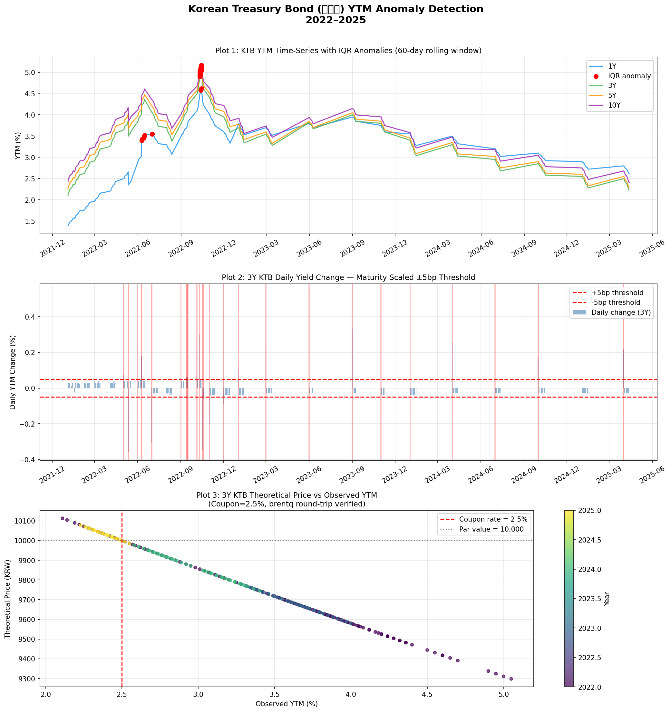

# Bond Evaluation Analytics — KTB Yield Anomaly Detection
# 국고채 수익률 이상치 탐지 파이프라인

> **Note**: This project focuses exclusively on fixed-income analytics.  
> 본 프로젝트는 채권 데이터 검증 및 수익률 분석에 특화된 독립 모듈입니다.

---

## 목적 / Purpose

한국 국고채(KTB) 수익률 데이터의 정합성을 자동 검증하고 이상치를 탐지하는 Python 파이프라인입니다.  
채권평가 실무에서 매일 수행되는 **"수익률 검증 → 이상치 플래깅 → 보고"** 흐름을 코드로 구현했습니다.

This pipeline automates data integrity validation for Korean Treasury Bond (KTB) yields —  
replicating the core daily workflow of a bond pricing analyst: collect → clean → flag → report.

---

## 데이터 출처 / Data Source

| 항목 | 내용 |
|------|------|
| 제공기관 | 한국은행 ECOS Open API |
| 통계표 코드 | 817Y002 (국고채수익률) |
| 수집 만기 | 1년 · 3년 · 5년 · 10년 |
| 주기 | 일별 (영업일) |
| 기간 | 2022-01-01 ~ 2025-12-31 |
| 시장 컨벤션 | KRX 장내채권 시장, T+1 결제, 복리 수익률 기준 |

**API 키 발급**: [ecos.bok.or.kr](https://ecos.bok.or.kr) → 회원가입 → Open API → 인증키 신청  
(키 없이도 내장 샘플 데이터로 실행 가능)

---

## 구현 방법론 / Methodology

### 1. IQR 기반 이상치 탐지 (Section 4)
- 60일 롤링 윈도우로 각 만기별 Q1·Q3·IQR 산출
- 탐지 기준: `YTM < Q1 - 1.5×IQR` 또는 `YTM > Q3 + 1.5×IQR`
- `min_periods=30` 설정으로 초기 윈도우 NaN 처리

### 2. 만기별 차등 전일 대비 변동폭 플래그 (Section 5)
장기물은 기간프리미엄·유동성프리미엄으로 자연 변동폭이 크므로, 단순 고정 임계값 대신 **만기별 차등 기준** 적용:

| 만기 | 임계값 |
|------|--------|
| 1Y | ±3bp |
| 3Y | ±5bp |
| 5Y | ±7bp |
| 10Y | ±10bp |

### 3. Duration & Convexity 계산 (Section 6)
- **Modified Duration**: 채권 가격의 금리 민감도 1차 근사 (years)
- **Convexity**: 2차 보정 — 대규모 금리 변동(예: 2022년 한은 급격한 금리 인상)에서 필수

$$\Delta P / P \approx -\text{MD} \cdot \Delta y + \frac{1}{2} \cdot \text{Convexity} \cdot (\Delta y)^2$$

### 4. scipy.optimize.brentq YTM 역산 (Section 7)
쿠폰율 2.5% 고정 3Y 국고채를 대상으로 관측 YTM → 이론가 → YTM 역산 검증:
- `price_from_ytm()`: 반기 현금흐름 할인합
- `ytm_from_price()`: `brentq(f, 1e-4, 0.99)` — 수치 해석으로 YTM 방정식의 비선형 역함수 계산
- Round-trip 오차 < 0.001bp — 솔버 정밀도 검증

---

## 시각화 / Visualization



- **Plot 1**: 4개 만기 YTM 시계열 + IQR 이상치 마킹 (빨간 점)
- **Plot 2**: 3Y 국고채 일별 변동폭 + 임계선 + 플래그 음영
- **Plot 3**: 이론가(가격) vs 관측 YTM 산점도 — brentq 검증

---

## 실행 방법 / How to Run

```bash
# 1. Install dependencies
pip install -r requirements.txt

# 2a. Run with ECOS API key (live data)
export ECOS_API_KEY=your_api_key_here
jupyter notebook bond_yield_analysis.ipynb

# 2b. Run without API key (sample data — no setup needed)
jupyter notebook bond_yield_analysis.ipynb
# ECOS_API_KEY is automatically set to 'sample' → embedded data is used
```

---

## Interview Talking Points

**Q. Why IQR instead of Z-score for anomaly detection?**  
A. Bond yields violate the normality assumption that Z-score requires. During the 2022 BoK hiking cycle, yields shifted from ~1.5% to ~4.5% — a regime change, not an anomaly. Z-score's mean and standard deviation would be distorted by these very outliers we're trying to detect, making the detection threshold unreliable. IQR uses Q1/Q3 (the middle 50%), which is unaffected by extreme values in either tail.

| | IQR | Z-score |
|---|---|---|
| Distribution assumption | None (non-parametric) | Normal distribution |
| Sensitivity to outliers | Robust — Q1/Q3 unaffected | High — mean/σ shift with outliers |
| Regime-change handling | Rolling window adapts | Threshold drifts with the regime |
| KTB yield suitability | ✓ | ✗ (fat tails, rate-hike regimes) |

**Q. Why maturity-scaled thresholds instead of a fixed 5bp?**  
A. Yield volatility increases with maturity due to term premium and liquidity premium differences. A 10Y KTB naturally moves ±10bp in volatile markets; applying 5bp uniformly would produce excessive false positives for long-end bonds.

**Q. Why brentq instead of Newton-Raphson for YTM?**  
A. `brentq` is guaranteed to converge when a valid bracket is found — no risk of divergence unlike Newton-Raphson near flat price-yield curves. For production bond pricing, stability is preferred over speed.

**Q. What would you add to productionize this?**  
A. (1) Accrued interest and Act/365 day-count convention for dirty vs clean price, (2) multi-curve bootstrapping for KRX bond curve construction (consistent with KIS자산평가 practice), (3) automated alerting pipeline to flag anomalies to the evaluation team.

---

## 기술 스택 / Tech Stack

`pandas` · `numpy` · `scipy.optimize` · `matplotlib` · `requests` · `python-dotenv`

---

## 관련 프로젝트 / Related Project

이 레포지토리의 메인 프로젝트는 KOSPI/KOSDAQ·NYSE 기업의 주식 밸류에이션 분석 도구입니다.  
본 폴더는 **채권 직무 지원을 위한 독립 분석 모듈**로 별도 운영됩니다.
