# MICRON TECHNOLOGY · NASDAQ: MU

> Review & Outlook — FY2026Q4 · 14 weeks · FY2026 53 weeks · Edition 1, Revision 1

This is third-party analysis based on public information and has not been prepared, reviewed, or approved by Micron or its affiliates.

Author: Jiwon Kim
Issue date: 2026-10-05
Data as of: 2026-10-01 (price) · 2026-09-30 (results)
Information cutoff: 2026-10-04 KST
Completeness: historical actuals, PREREG_A scoring, post-print actuals and RLE
- The pre-registered forecast and post-print estimates remain separate.
- Scenarios are an unweighted range and carry no probabilities.
- Net cash is not adjusted for SCA deposits.

As of the pre-publication confirmation time (2026-10-05T19:07:00+09:00), the author, Jiwon Kim, does not hold shares of Micron Technology, Inc. (MU).

### Market data

| Metric | Value | Basis |
|---|---:|---|
| Reference price | 1,097.39 | USD/share · 2026-10-01 |
| Diluted weighted-average shares (FQ4) | 1,147 | million shares · FQ4 A-8K |
| Market capitalization | 1,258,706 | USD million · price × shares |
| Fiscal year end | 2026-09-03 | A-8K |

Market capitalization is in USD million and equals the reference price times FQ4 diluted weighted-average shares; it is not based on period-end shares outstanding.

### Key figures

| Metric | Value | Basis |
|---|---:|---|
| FQ4 revenue | 52,860 | PREREG_A · USD million |
| FQ4 revenue | 54,229 | A-8K · USD million |
| FQ4 GAAP EPS | 32.57 | PREREG_A · USD/share |
| FQ4 GAAP EPS | 32.87 | A-8K · USD/share |
| FY26 revenue | 131,819 | PREREG_A · USD million |
| FY26 revenue | 133,188 | A-8K · USD million |
| FY27E revenue | 274,784 | RLE base path · USD million |
| FY27E GAAP EPS | 169.05 | RLE base path · USD/share |
| FY28E revenue | 274,784 | RLE base path · USD million |
| FY28E GAAP EPS | 162.24 | RLE base path · USD/share |

<!-- TOC_START -->
## Contents

- [1. Company overview and reading rules](#section-company)
- [2. Bull and bear cases](#section-thesis)
- [3. Pre-registration versus actuals](#section-fq4)
- [4. Outlook](#section-outlook)
- [5. Business structure](#section-business)
- [6. Financial statements](#section-financials)
- [7. Margin bridge](#section-margin_bridge)
- [8. Scenarios](#section-scenarios)
- [9. Valuation](#section-valuation)
- [10. Risks and swing factors](#section-risks)
- [11. Catalysts and schedule](#section-catalysts)
- [12. Appendix](#section-appendix)

<!-- TOC_END -->

<!-- BOX_START -->
### Abbreviations and sources

**Prepared remarks** — Micron FQ4 FY26 earnings call prepared remarks (2026-09-30, 10 pages)

**Press release** — Micron FQ4 FY26 earnings press release (8-K EX-99.1, accession 0000723125-26-000018)

**SCORED** — The author's post-print scoring of the FQ4 FY26 pre-registered forecast (forecast/reports/mu_fy2026q4_SCORED.md)

**RLE** — Report-Layer Estimate: this report's FY27E–FY28E estimates anchored on post-print guidance

**PREREG_A** — The FQ4 FY26 forecast frozen before the print (Freeze A)

<!-- BOX_END -->

## 1. Company overview and reading rules

This section sets out the company overview and the report's information boundaries.

Micron is a US semiconductor company making DRAM and NAND memory and storage. It reports four business units: Cloud Memory (CMBU), Core Data Center (CDBU), Mobile and Client (MCBU), and Automotive and Embedded (AEBU). FQ4 FY26 revenue was 54,229, with DRAM at 73% of revenue (prepared remarks p.7).

FY2026 has 53 weeks and FQ4 has 14. When comparing with 13-week quarters, growth is also shown on a per-week basis (14-week revenue ÷ 14 versus 13-week revenue ÷ 13).

Numbers in this report sit in three layers: ① PREREG_A, the forecast frozen before the print (never altered); ② A-8K, company-reported actuals (provisional until the 10-K); ③ RLE, the author's estimates anchored on post-print guidance. Each table and chart header states its layer.

UNAVAILABLE marks cells the rules deliberately do not compute (for example, the RLE balance sheet). It avoids inventing values; each table footnote gives the reason.

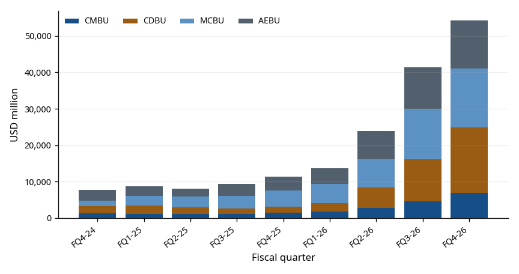

CAPTION: Figure 1. Business-unit revenue mix — USD million · Micron quarterly earnings releases (8-K EX-99.1); Micron FQ4 FY26 earnings release (8-K EX-99.1) (FQ1-25, FQ1-26, FQ2-26, FQ4-24) · 2026-10-04 · Evidence grade / accounting basis: GAAP actual (A) business-unit revenue

## 2. Bull and bear cases

The arguments below are things to monitor, not conclusions. Each one lists what observation would show it to be wrong (falsifier).

### **Bull case**

#### **The company said supply will be tighter in 2027 and 2028 than in 2026.**

| Year | Company statement | Page |
|---|---|---|
| 2027 | DRAM and NAND expected to remain supply constrained | Micron FQ4 FY26 prepared remarks p.5 |
| 2028 | DRAM and NAND expected to remain supply constrained | Micron FQ4 FY26 prepared remarks p.5 |

Management expects industry DRAM and NAND to remain supply constrained in both years and sees no line of sight to balance (prepared remarks p.5).

**Falsifier:** A quarterly script that drops the 'supply constrained' language, or the first quarter in which DRAM price change turns negative.

*Source: Micron FQ4 FY26 prepared remarks p.5*

#### **FQ1 FY27 revenue guidance accelerated on a per-week basis.**

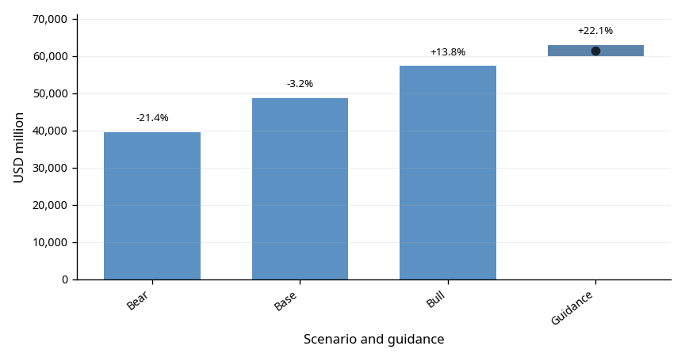

CAPTION: Figure 2. FQ1 FY27 guidance vs pre-registered forecast — USD million · Micron FQ4 FY26 earnings release (8-K EX-99.1); MU FQ4 FY26 pre-registered forecast (Freeze A) · 2026-10-04 · Evidence grade / accounting basis: GAAP PREREG_A + GUIDANCE · Forecasts are approximate guidance midpoints from the pre-registered forecast §(c-2). The range bar spans company guidance low to high; the point marks the midpoint. % labels are per-week growth: FQ1/13 weeks versus actual FQ4 revenue/14 weeks.

The guidance midpoint of $61,500M is 22.1% per week above FQ4 actual. Management expects sequential revenue growth in every FY27 quarter (prepared remarks p.9).

**Falsifier:** FQ1 FY27 actual revenue below the low end of guidance, $60,000M.

*Source: Micron FQ4 FY26 press release (8-K EX-99.1) business outlook · Micron FQ4 FY26 prepared remarks p.9 · SCORED §8*

#### **Strategic customer agreements (SCAs) put a price floor under part of revenue.**

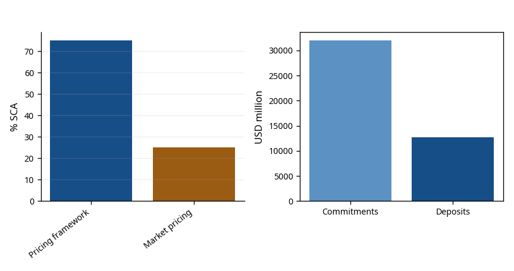

CAPTION: Figure 3. SCA structure — Company statements / USD million / % · Micron FQ4 FY26 prepared remarks · 2026-10-04 · Evidence grade / accounting basis: Company statement · Over 35% is the SCA share of total revenue through 2030; 75%/25% split SCA revenue. Deposits of $12.7B are the prepared-remarks balance, distinct from EX-99.1 noncurrent customer contract liabilities of 12,895.

Micron has signed 26 SCAs, which it estimates at over 35% of revenue through 2030. 75% of that has a defined pricing framework, mostly bands with floors and ceilings (prepared remarks p.3).

**Falsifier:** A disclosed SCA termination or renegotiation, or a decline in customer deposit balances of $12,895M.

*Source: Micron FQ4 FY26 prepared remarks p.3 · Micron FQ4 FY26 press release (8-K EX-99.1) balance sheet*

### **Bear case**

#### **Slower price increases are the company's own statement.**

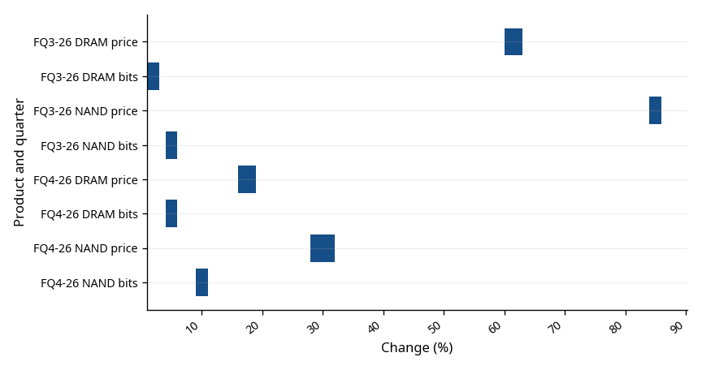

CAPTION: Figure 4. DRAM and NAND price and bit changes (company ranges) — % · Micron FQ3/FQ4 FY26 prepared remarks p.7 · 2026-10-04 · Evidence grade / accounting basis: Company statement + J (author judgement) · J (judgement) conversion, not company figures: low-single-digit = 1–3%; mid-single-digit = 4–6%; ≈10% = 9–11%; high-teens = 16–19%; ≈30% = 28–32%; low-60s = 60–63%; mid-80s = 84–86%

While guiding to higher gross margin after FQ1, management said price increases will be more moderate (prepared remarks p.9).

**Falsifier:** The FQ2 FY27 script reports DRAM price growth above the FQ4 FY26 high-teens percent.

*Source: Micron FQ4 FY26 prepared remarks p.7, p.9*

#### **SCA price ceilings cap upside in a rising market.**

(See Figure 3)

Most SCA revenue with a defined framework sits in bands with ceilings; above the ceiling, that revenue does not follow market prices (prepared remarks p.3).

**Falsifier:** The company discloses the share of revenue at the ceiling, and it is small.

*Source: Micron FQ4 FY26 prepared remarks p.3*

#### **Costs and investment are rising fast.**

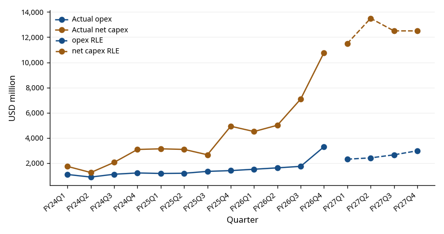

CAPTION: Figure 5. Operating expenses and net capex trend — USD million · Micron quarterly earnings releases (8-K EX-99.1); Micron FQ4 FY26 earnings release (8-K EX-99.1); This report's FY27E–FY28E estimates (RLE) (FQ1-25, FQ1-26, FQ2-24, FQ2-25, FQ2-26, FQ3-24, FQ3-25, FQ4-24, FQ4-25) · 2026-10-04 · Evidence grade / accounting basis: GAAP opex / company-adjusted net capex A + RLE · Solid=actual, dashed=RLE; excluded quarters: none (12 quarters verified in sources). Missing source values remain blank, without estimation or interpolation.

FY27 opex rises by about $2.5B (prepared remarks p.9) and first-half net capex alone is about $25B (prepared remarks p.10). FQ4 GAAP opex ran 77.2% above guidance (SCORED §4).

**Falsifier:** FY27 quarterly GAAP opex comes in below the RLE path ($10,353M).

*Source: Micron FQ4 FY26 prepared remarks p.9–10 · SCORED §4*

## 3. Pre-registration versus actuals

The pre-registered forecast and reported actuals are compared on the same basis.

<!-- BOX_START -->
### Scoring criteria

**Guidance-label hit** — Before the print, each metric got a 'no-difference range' (revenue $49,000M–$51,000M, GAAP GM guidance ±1pt, etc.). Above the range is 'above high', inside is 'in range', below is 'below low'. A hit means the pre-registered forecast gave the same label.

**Band coverage** — Checks whether the actual fell inside the pre-registered bear–bull range. Falling outside would mean the forecast's uncertainty band was too narrow.

**Next-quarter direction (SF7)** — FQ1 FY27 guidance within ±2% per week of FQ4 is flat; above is growth; below is decline. The pre-registered call was flat; actual guidance implied 22.1% per-week growth, so it missed.

<!-- BOX_END -->

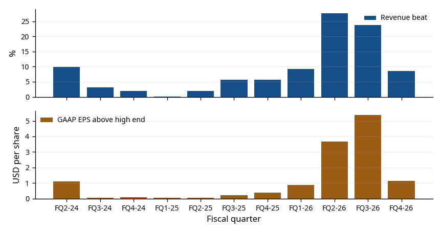

CAPTION: Figure 6. Revenue guidance beat and GAAP EPS above high end — % / USD per share · MU FQ4 FY26 pre-registered forecast (Freeze A); Micron quarterly earnings releases (8-K EX-99.1); MU FQ4 FY26 pre-registration scoring document (FQ1-25, FQ1-26, FQ2-24, FQ2-25, FQ2-26, FQ3-24, FQ3-25, FQ3-26, FQ4-24, FQ4-25) · 2026-10-04 · Evidence grade / accounting basis: GAAP actual and guidance

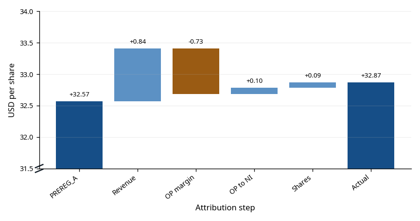

CAPTION: Figure 7. 4-lever EPS error waterfall — USD per share · MU FQ4 FY26 pre-registration scoring document · 2026-10-04 · Evidence grade / accounting basis: GAAP SCORED

(See Figure 2)

### Quoted SCORED summary

| Metric | Actual | Pre-registered base | Error | Absolute percentage error |
|---|---:|---:|---:|---:|
| Revenue | 54,229 | 52,860 | 1,369 | 2.5% |
| GAAP diluted EPS | $32.87 | $32.57 | $0.30 | 0.9% |
| Non-GAAP diluted EPS | $33.42 | $32.84 | $0.58 | 1.7% |
| GAAP operating expenses | 3,296 | 1,860 | 1,436 | 43.6% |

Guidance labels: 4/4 hit
Band coverage: PASS · 49,000–58,223 · $29.33–$36.66
Four-lever GAAP EPS attribution: +$0.84 / −$0.73 / +$0.10 / +$0.09 = +$0.30
Next-quarter direction verdict: MISS

| Metric | No-difference range | Actual | Actual label | Forecast label | Result |
|---|---|---:|---|---|---|
| Revenue | 49,000–51,000 | 54,229 | Above high | Above high | HIT |
| GAAP diluted EPS | 29.73–31.73 | 32.87 | Above high | Above high | HIT |
| Non-GAAP diluted EPS | 30.00–32.00 | 33.42 | Above high | Above high | HIT |
| GAAP GM | 85.0–87.0% | 86.76% | In range | In range | HIT |
| GAAP opex | Not declared | 3,296 | No label (no guidance) | n/a (no guidance) | Narrative failure |

GAAP opex had no company guidance, so it is not label-scored; actual exceeded the pre-registered base by 77%, recorded as a narrative failure (SCORED §4).

## 4. Outlook

Company guidance and report-layer estimates remain in separate columns.

The amount by which GAAP gross margin (GM) beat the guidance midpoint shrank quickly, from +7.41%p in FQ2 FY26 to +3.56%p in FQ3 and +0.76%p in FQ4. The quarter-on-quarter rise in GM narrowed over the same period.

FQ1 FY27 GAAP GM guidance is 85.95%, below FQ4 actual. Management attributes this to higher FQ4 incentive compensation absorbed into inventory and flowing into FQ1 GM, and calls FQ1 the FY27 floor (prepared remarks p.9).

Reading: GM is already high, leaving little room to rise, and management has flagged slower price increases. A further shrinking or negative beat would be the first sign of a slowing price cycle; this links to the 'price cycle' watch item in the risks section.

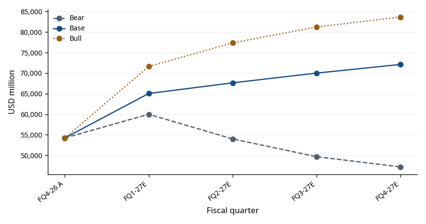

CAPTION: Figure 8. FQ4 actual to FY27E scenarios — USD million · Micron FQ4 FY26 earnings release (8-K EX-99.1); This report's FY27E–FY28E estimates (RLE) · 2026-10-04 · Evidence grade / accounting basis: GAAP actual (A-8K) + unweighted RLE paths

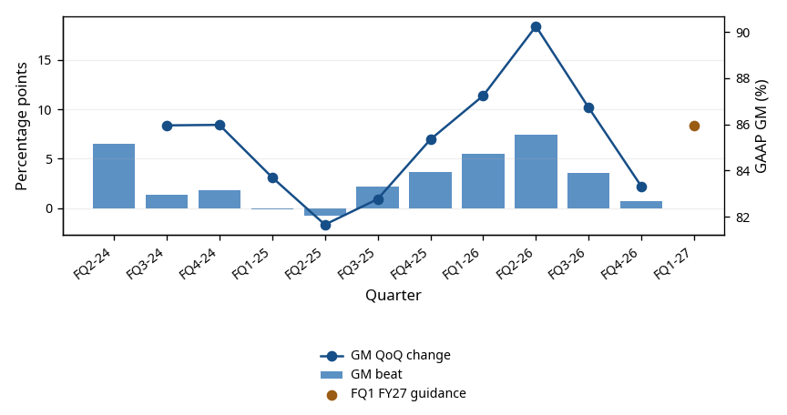

CAPTION: Figure 9. Compression of GAAP GM beats — %p · Micron FQ4 FY26 earnings release (8-K EX-99.1); MU FQ4 FY26 pre-registered forecast (Freeze A); MU FQ4 FY26 pre-registration scoring document · 2026-10-04 · Evidence grade / accounting basis: GAAP A + GUIDANCE · Bars and lines use left-axis percentage points; FQ1 FY27 guidance uses right-axis GAAP GM %. First-quarter QoQ is blank without a preceding source point.

### FQ1 FY27 company guidance

| Metric | GAAP | Non-GAAP | Basis |
|---|---:|---:|---|
| Revenue | 61,500 ± 1,500 | 61,500 ± 1,500 | USD million, midpoint ± range |
| Gross margin | 85.95% | 86.25% | Approximate |
| Operating expenses | 2,310 | 2,060 | USD million, approximate |
| Diluted EPS | $37.84 ± $1.00 | $38.15 ± $1.00 | USD/share, midpoint ± range |
| Diluted weighted-average shares | 1,150M | 1,150M | million, approximate |

## 5. Business structure

Business-unit mix and pricing and shipment signals are shown in the categories disclosed by the company.

FQ4 FY26 revenue by business unit was CDBU $18.0B (33%), CMBU $16.3B (30%), MCBU $13.1B (24%) and AEBU $6.8B (13%). All four were records; sequential growth was CDBU 56%, AEBU 47%, CMBU 18% and MCBU 14% (prepared remarks p.7–8).

Business-unit GM was 90% for CDBU and MCBU, 84% for AEBU and 83% for CMBU. Only CMBU was flat sequentially; management said higher HBM mix offset higher pricing (prepared remarks p.7). Management also said most 2027 HBM supply is contracted at significantly higher prices year over year, narrowing the GM gap with conventional DRAM (prepared remarks p.4).

By product, DRAM was $39.8B (73%) and NAND $14.1B (26%). Data center SSD revenue was close to $10B, over 2/3 of NAND revenue (prepared remarks p.4, p.7).

Reading: 63% of revenue comes from the data center units (CMBU, CDBU), so the key variables in this report are server and AI demand and DRAM pricing. MCBU revenue rose on price despite lower bit shipments (prepared remarks p.7). If pricing turns, units with weak bit growth may see revenue fall first.

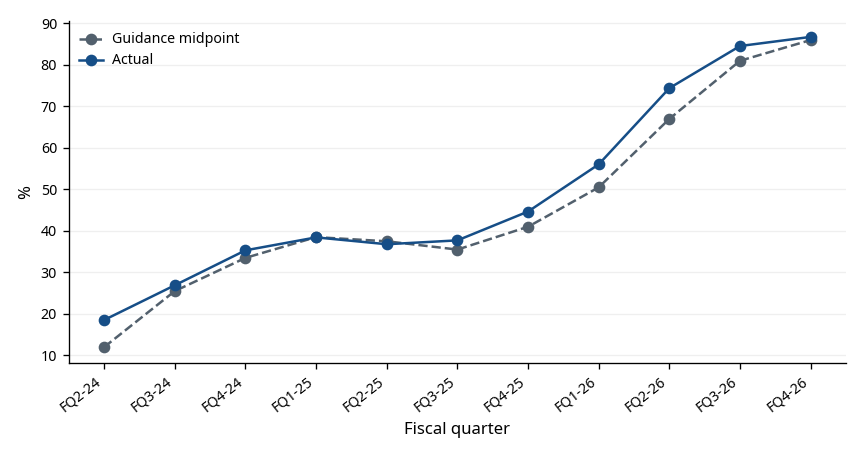

CAPTION: Figure 10. GAAP gross-margin guidance versus actual — % · MU FQ4 FY26 pre-registered forecast (Freeze A); MU FQ4 FY26 pre-registration scoring document · 2026-10-04 · Evidence grade / accounting basis: GAAP guidance and actual

(See Figure 9)

(See Figure 4)

Micron discloses price and bit-shipment changes only as range wording such as 'high-teens %' or 'mid-single-digit' (prepared remarks p.7). The chart draws these ranges as bars; the conversion rule (e.g., high-teens = 16–19%) is in the chart footnote. The conversion is the author's judgement, not a company figure.

## 6. Financial statements

The financial statements and key ratios draw from one fact manifest.

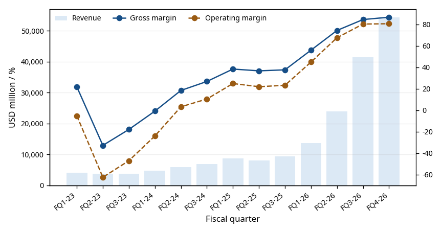

CAPTION: Figure 11. Quarterly revenue and GAAP margins — USD million / % · SEC EDGAR Micron financial disclosures; Micron FQ4 FY26 earnings release (8-K EX-99.1) · 2026-10-04 · Evidence grade / accounting basis: GAAP actual (A); FQ4 has 14 weeks

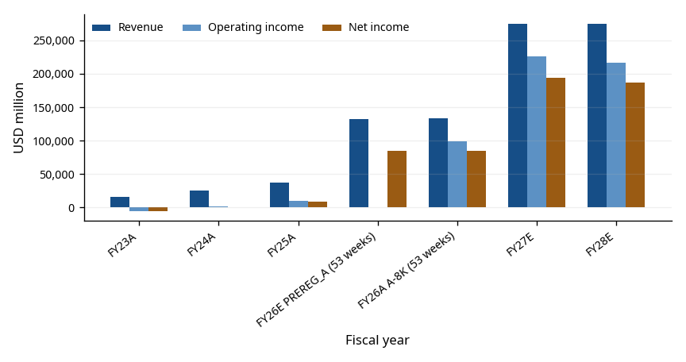

CAPTION: Figure 12. Annual revenue, operating income and net income — USD million · Micron FY2025 Form 10-K; Micron FQ4 FY26 earnings release (8-K EX-99.1); MU FQ4 FY26 pre-registered forecast (Freeze A); This report's FY27E–FY28E estimates (RLE) · 2026-10-04 · Evidence grade / accounting basis: GAAP actual (A) + PREREG_A + RLE

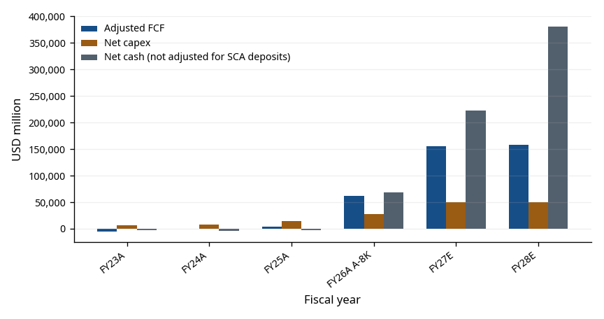

CAPTION: Figure 13. Adjusted FCF, net capex and net cash (not adjusted for SCA deposits) — USD million · Micron FY2023 Form 10-K; Micron FY2025 Form 10-K; Micron FQ4 FY26 earnings release (8-K EX-99.1); This report's FY27E–FY28E estimates (RLE) · 2026-10-04 · Evidence grade / accounting basis: GAAP cash-flow framework and RLE; SCA deposits not forecast

### Income statement summary (USD million, except per-share data)

| Metric | FY23A | FY24A | FY25A | FY26E PREREG_A | FY26A A-8K | FY27E RLE | FY28E RLE |
|---|---:|---:|---:|---:|---:|---:|---:|
| Revenue | 15,540 | 25,111 | 37,378 | 131,819 | 133,188 | 274,784 | 274,784 |
| Cost of revenue | 16,956 | 19,498 | 22,505 | —† | 25,684 | 38,607 | 46,851 |
| Gross profit | -1,416 | 5,613 | 14,873 | —† | 107,504 | 236,177 | 227,933 |
| Operating expenses | — | — | — | —† | 8,164 | 10,353 | 11,181 |
| R&D | 3,114 | 3,430 | 3,798 | —† | 5,650 | —‡ | —‡ |
| SG&A | 920 | 1,129 | 1,205 | —† | 1,947 | —‡ | —‡ |
| Restructuring | 171 | 1 | 39 | —† | 0 | —‡ | —‡ |
| Other operating | 124 | -251 | 61 | —† | 567 | —‡ | —‡ |
| Operating income | -5,745 | 1,304 | 9,770 | —† | 99,340 | 225,824 | 216,752 |
| Interest income | 468 | 529 | 496 | —† | 1,084 | —‡ | —‡ |
| Interest expense | -388 | -562 | -477 | —† | -106 | —‡ | —‡ |
| Other non-operating | 7 | -31 | -135 | —† | -647 | —‡ | —‡ |
| Pretax income | -5,658 | 1,240 | 9,654 | —† | 99,671 | 225,197 | 216,126 |
| Below-operating items | — | — | — | —† | 331 | -627 | -627 |
| Income tax | -177 | -451 | -1,124 | —† | -14,761 | -30,794 | -29,553 |
| Equity-method result | 2 | -11 | 9 | —† | 59 | —‡ | —‡ |
| Net income | -5,833 | 778 | 8,539 | 84,720 | 84,969 | 194,404 | 186,572 |
| Diluted shares | 1,093 | 1,118 | 1,125 | —† | 1,143M | 1,150M | 1,150M |
| Diluted EPS | -5.34 | 0.70 | 7.59 | 73.90 | $74.33 | $169.05 | $162.24 |

† Freeze A forecast only the FQ4 quarter and FY26 revenue, net income and EPS.
‡ RLE rules estimate only parts of income and cash flow, not the balance sheet (appendix rules A11–A16).

### Balance sheet summary (USD million)

| Metric | FY23A | FY24A | FY25A | FY26E PREREG_A | FY26A A-8K | FY27E RLE | FY28E RLE |
|---|---:|---:|---:|---:|---:|---:|---:|
| Cash | 8,577 | 7,041 | 9,642 | —† | 38,364 | —‡ | —‡ |
| Short-term investments | 1,017 | 1,065 | 665 | —† | 5,070 | —‡ | —‡ |
| Receivables | 2,443 | 6,615 | 9,265 | —† | 36,197 | —‡ | —‡ |
| Inventories | 8,387 | 8,875 | 8,355 | —† | 10,372 | —‡ | —‡ |
| Current assets | 21,244 | 24,372 | 28,841 | —† | 91,070 | —‡ | —‡ |
| Long-term investments | 844 | 1,046 | 1,629 | —† | 30,019 | —‡ | —‡ |
| Property, plant and equipment | 37,928 | 39,749 | 46,590 | —† | 63,310 | —‡ | —‡ |
| Total assets | 64,254 | 69,416 | 82,798 | —† | 195,888 | —‡ | —‡ |
| Accounts payable and accrued expenses | 3,958 | 7,299 | 9,649 | —† | 22,605 | —‡ | —‡ |
| Current debt | 278 | 431 | 560 | —† | 491 | —‡ | —‡ |
| Current liabilities | 4,765 | 9,248 | 11,454 | —† | 27,482 | —‡ | —‡ |
| Long-term debt | 13,052 | 12,966 | 14,017 | —† | 4,688 | —‡ | —‡ |
| Total liabilities | 20,134 | 24,285 | 28,633 | —† | 57,510 | —‡ | —‡ |
| Total equity | 44,120 | 45,131 | 54,165 | —† | 138,378 | —‡ | —‡ |

† Freeze A forecast only the FQ4 quarter and FY26 revenue, net income and EPS.
‡ RLE rules estimate only parts of income and cash flow, not the balance sheet (appendix rules A11–A16).

### Cash-flow statement summary (USD million)

| Metric | FY23A | FY24A | FY25A | FY26E PREREG_A | FY26A A-8K | FY27E RLE | FY28E RLE |
|---|---:|---:|---:|---:|---:|---:|---:|
| Net income | -5,833 | 778 | 8,539 | —† | 84,969 | 194,404 | 186,572 |
| Depreciation and amortization | 7,756 | 7,780 | 8,352 | —† | 9,503 | 14,096 | 19,837 |
| Stock-based compensation | 596 | 833 | 972 | —† | 1,333 | 1,972 | 2,130 |
| Working-capital investment | — | — | — | —† | —‡ | -4,882 | 0 |
| Change in receivables | 2,763 | -3,581 | -1,776 | —† | -25,206 | —‡ | —‡ |
| Change in inventories | -3,555 | -488 | 520 | —† | -2,017 | —‡ | —‡ |
| Change in accounts payable | -1,302 | 1,915 | 862 | —† | 8,707 | —‡ | —‡ |
| Change in other current liabilities | -817 | 989 | -272 | —† | 3,141 | —‡ | —‡ |
| Operating cash flow | 1,559 | 8,507 | 17,525 | —† | 89,675 | 205,589 | 208,539 |
| PPE expenditures | -7,676 | -8,386 | -15,857 | —† | -30,712 | —‡ | —‡ |
| Government incentives | 710 | 315 | 2,005 | —† | 3,316 | —‡ | —‡ |
| PPE disposal proceeds | — | — | — | —† | 29 | —‡ | —‡ |
| Net capex | 6,966 | 8,071 | 13,852 | —† | 27,367 | 50,000 | 50,000 |
| Adjusted FCF | -5,407 | 436 | 3,673 | —† | 62,308 | 155,589 | 158,539 |
| Investing cash flow | -6,191 | -8,309 | -14,087 | —† | -61,641 | —‡ | —‡ |
| Debt repayments | -761 | -1,897 | -4,619 | —† | -10,043 | —‡ | —‡ |
| Debt issuance | 6,716 | 999 | 4,430 | —† | 0 | —‡ | —‡ |
| Share repurchases | — | — | — | —† | -1,777 | —‡ | —‡ |
| Dividends | -504 | -513 | -522 | —† | -610 | -690 | -690 |
| Financing cash flow | 4,983 | -1,842 | -850 | —† | 630 | —‡ | —‡ |
| FX effect | -34 | 40 | 6 | —† | 81 | —‡ | —‡ |
| Change in cash | 317 | -1,604 | 2,594 | —† | 28,745 | —‡ | —‡ |

† Freeze A forecast only the FQ4 quarter and FY26 revenue, net income and EPS.
‡ RLE rules estimate only parts of income and cash flow, not the balance sheet (appendix rules A11–A16).

### Key ratios and working capital (%, days, USD million)

| Metric | FY23A | FY24A | FY25A | FY26E PREREG_A | FY26A A-8K | FY27E RLE | FY28E RLE |
|---|---:|---:|---:|---:|---:|---:|---:|
| Gross margin | -9.1% | 22.4% | 39.8% | —† | 80.7% | 86.0% | 83.0% |
| Operating margin | -37.0% | 5.2% | 26.1% | —† | 74.6% | 82.2% | 78.9% |
| Effective tax rate | -3.1% | 36.4% | 11.6% | —† | 14.8% | 13.7% | 13.7% |
| ROE | -12.4% | 1.7% | 17.2% | —† | 88.3% | —‡ | —‡ |
| Inventory days | 161.5 | 161.1 | 139.3 | —† | 135.3 | —‡ | —‡ |
| Net capex / revenue | 44.8% | 32.1% | 37.1% | —† | 20.5% | 18.2% | 18.2% |
| Net cash (not adjusted for SCA deposits) | -2,892 | -4,245 | -2,641 | —† | 68,274 | 223,173 | 381,022 |

† Freeze A forecast only the FQ4 quarter and FY26 revenue, net income and EPS.
‡ RLE rules estimate only parts of income and cash flow, not the balance sheet (appendix rules A11–A16).

## 7. Margin bridge

The margin bridge separates changes in gross profit from changes in operating expense.

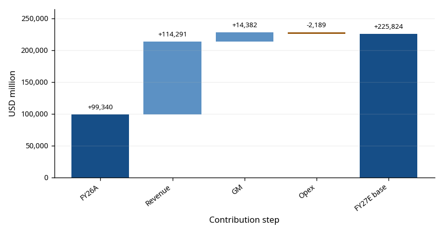

CAPTION: Figure 14. FY26A to FY27E base operating-income bridge — USD million · Micron FQ4 FY26 earnings release (8-K EX-99.1); This report's FY27E–FY28E estimates (RLE) · 2026-10-04 · Evidence grade / accounting basis: GAAP A + RLE

### GAAP margin and operating-expense bridge

| Interval | Metric | Start | End | Change / operating-margin contribution |
|---|---|---:|---:|---:|
| FQ3→FQ4 FY26 actual | Gross margin | 84.6% | 86.8% | +2.2%p |
| FQ3→FQ4 FY26 actual | Operating expenses (USD million) | 1,738 | 3,296 | 1,558 |
| FQ3→FQ4 FY26 actual | Operating expenses / revenue | 4.2% | 6.1% | -1.9%p |
| FY26A→FY27E base | Gross margin | 80.7% | 86.0% | +5.2%p |
| FY26A→FY27E base | Operating expenses (USD million) | 8,164 | 10,353 | 2,189 |
| FY26A→FY27E base | Operating expenses / revenue | 6.1% | 3.8% | +2.4%p |

The gross-margin change plus the contribution from a lower operating-expense ratio equals the operating-margin change. The expense-amount row separately shows the change in USD million.

## 8. Scenarios

This section keeps two layers apart: ① the FQ4 FY26 forecast frozen before the print (PREREG_A) and its scoring, and ② report-layer estimates (RLE) for FY27E–FY28E anchored on post-print guidance. ① was not altered; ② is not evidence of forecasting skill.

PREREG_A scoring: all 4 guidance-range labels hit, revenue and GAAP EPS fell inside the pre-registered bands, and the GAAP EPS error was $0.30. The EPS hit came from revenue upside offsetting an opex overrun, and the FQ1 direction call (flat) missed (SCORED §6, §8).

RLE shows three paths side by side (bear, base, bull) with no probabilities or weighted average. Base FY27E revenue is $274,784.14M and GAAP EPS $169.05; bear and bull EPS are $118.95 and $199.52.

Assumption rules were set before the print (HANDOFF R9); after the print only three items changed: the base GM path (management called FQ1 the FY27 gross-margin floor), total opex (company guidance), and capex (replaced by guidance). The appendix lists each original rule, the change and the reason. One limitation: the rule hash was recorded after the print, so the only evidence of pre-registration is the conversation log.

Sensitivity rows show three alternative growth paths and the original GM rule next to the base. A 0/0/0% growth path is not neutral: with continued bit growth it implies falling prices.

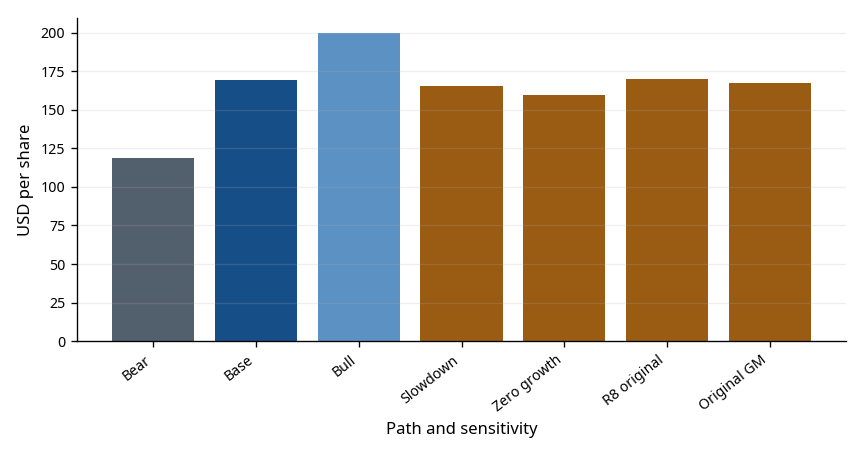

CAPTION: Figure 15. FY27E scenario and sensitivity EPS — USD per share · This report's FY27E–FY28E estimates (RLE) · 2026-10-04 · Evidence grade / accounting basis: GAAP RLE

## 9. Valuation

The valuation table shows its reference dates and calculation basis.

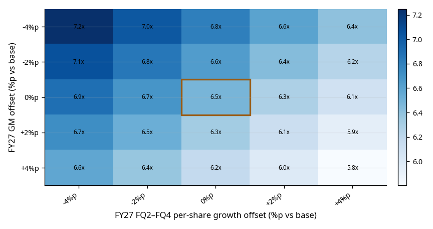

CAPTION: Figure 16. Implied P/E sensitivity — multiple; axes in %p · Nasdaq MU 2026-10-01 closing-price record 1 · 2026-10-04 · Evidence grade / accounting basis: Center cell=base path; fixed reference price; recalculated GAAP EPS RLE

### Reference-price implied multiples

| Period and path | P/E | EV/EBITDA | EV/Sales | FCF yield |
|---|---:|---:|---:|---:|
| FY2025A | 144.58x | 65.69x | 31.85x | 0.3% |
| FY2026A | 14.76x | 10.94x | 8.94x | 5.0% |
| FY2027E.bear | 9.23x | 6.78x | 5.65x | 8.0% |
| FY2027E.base | 6.49x | 4.96x | 4.33x | 12.4% |
| FY2027E.bull | 5.50x | 4.27x | 3.79x | 15.0% |
| FY2028E.bear | 17.02x | 11.08x | 7.53x | 3.8% |
| FY2028E.base | 6.76x | 5.03x | 4.33x | 12.6% |
| FY2028E.bull | 4.95x | 3.79x | 3.45x | 17.9% |

Trailing P/B: 9.10x · A-8K

Price date 2026-10-01 · equity date 2026-09-03 · shares use FQ4 diluted weighted-average shares

## 10. Risks and swing factors

### **Price cycle**

The key variable is when slower price increases turn into price declines. In past cycles, quarterly revenue fell by double digits right after the peak. The bear path tempers this tail but does not rule it out.

*Source: Micron FQ4 FY26 prepared remarks p.9 · RLE A2, A3*

### **One-offs above operating income**

In FQ4, a patent license charge and other operating expense sat above operating income and pushed opex well above guidance. The pre-registered below-OP watch item (SF5) did not cover this, and FY27 incentive compensation can move through the same line.

*Source: Micron FQ4 FY26 press release (8-K EX-99.1) · SCORED §4, §7*

### **Rising investment**

Management guided FY27 net capex of about $25B in the first half and higher in the second. RLE sets the second half equal to the first (a floor), so FCF may be overstated.

*Source: Micron FQ4 FY26 prepared remarks p.10 · RLE A14*

### **SCA structure**

Price floors limit downside and ceilings limit upside. Customer deposits are financing cash flows and are returned late in each contract. Net cash in this report is not adjusted for deposits.

*Source: Micron FQ4 FY26 prepared remarks p.3, p.8–9*

### **Capital return and share count**

Micron plans to increase capital return from 2026-12-09 and over time return 100% of excess cash. RLE includes no buybacks, so EPS upside from them is omitted.

*Source: Micron FQ4 FY26 prepared remarks p.9 · RLE A7*

### **FY28**

Management expects supply to stay tight in 2028, while new cleanroom output builds from late 2028. FY28E is shown only as an unweighted stress range.

*Source: Micron FQ4 FY26 prepared remarks p.2–3, p.5 · RLE A8–A10*

(See Figure 5)

## 11. Catalysts and schedule

| When | What to check | Source |
|---|---|---|
| 2026-10-14 / 10-29 | Quarterly dividend record / payment date ($0.15 per share) | Micron FQ4 FY26 press release (8-K EX-99.1) |
| 2026-10 (expected) | FY26 10-K filing — 8-K provisional actuals checked against the 10-K; scoring moves from provisional to final | SCORED |
| From 2026-12-09 | Start of increased capital return | Micron FQ4 FY26 prepared remarks p.9 |
| FQ1 FY27 earnings (date not announced) | Check revenue vs guidance and the GM-floor statement; first RLE comparison | Micron FQ4 FY26 prepared remarks p.9 |
| Early CY2027 | Initial output from Singapore HBM advanced packaging | Micron FQ4 FY26 prepared remarks p.3 |
| Mid CY2027 | Idaho ID1 wafer output; meaningful shipments from Tongluo, Taiwan | Micron FQ4 FY26 prepared remarks p.2–3 |
| Second half of CY2027 | Next-generation DRAM and NAND nodes begin volume production | Micron FQ4 FY26 prepared remarks p.2 |
| Second half of CY2028 | Output from ID2, the Japan DRAM expansion and the new Singapore NAND facility | Micron FQ4 FY26 prepared remarks p.2–3 |

## 12. Appendix

The appendix brings together the prior rules, post-print changes, interpretation correction and timing limitation.

### Pre-print rule table

Overall rule confidence: low

Evidence grades: E (company/pre-print input), D (calculated), J (author judgement). Ratios are percentages; amounts are USD million and shares are million shares.

| Item | Rule in words | Applied value | Evidence grade | Source |
|---|---|---|---|---|
| First-quarter revenue | Bear uses the guidance low end; base and bull apply historical beats to the midpoint. | Bear: 60000; Base: 65036.2; Bull: 71616.8; Company-midpoint sensitivity: 61500 | E / J | Micron FQ4 FY26 earnings release (8-K EX-99.1); MU FQ4 FY26 pre-registration scoring document; Author-approved pre-print rules, post-print changes and interpretation correction |
| Later-quarter weekly revenue growth | Later-quarter revenue applies each path's growth rate to prior-quarter revenue per week. | Bear: −10.00%/−8.00%/−5.00%; Base: 4.00%/3.50%/3.00%; Bull: 8.00%/5.00%/3.00%; Slowdown sensitivity: 3.00%/2.00%/1.00% | E·D / J | Author-approved pre-print rules, post-print changes and interpretation correction |
| Decline parallel path | Activate the parallel decline path when FQ1 weekly growth is at most −2%. Weekly growth is (FQ1 revenue / 13) / (FQ4 actual revenue / 14) − 1. | Trigger: FQ1 weekly growth ≤ −2%; Observed growth: 22.13%; Availability: not activated | E / J | Author-approved pre-print rules, post-print changes and interpretation correction; Micron FQ4 FY26 earnings release (8-K EX-99.1) |
| GAAP gross margin | Quarterly gross profit equals each path's revenue times its GAAP gross margin. | Bear: 84.95%/82.45%/79.95%/77.45%; Base: 85.95%/85.95%/85.95%/85.95%; Bull: 86.95%/87.45%/87.95%/88.45%; Original pre-print sensitivity: 85.95%/85.45%/84.95%/84.45% | E / J | Micron FQ4 FY26 earnings release (8-K EX-99.1); Author-approved pre-print rules, post-print changes and interpretation correction; Micron FQ4 FY26 prepared remarks |
| GAAP operating expenses | Allocate first-quarter GAAP guidance and the annual expense outlook across quarters. | FQ1–FQ4, all paths: 2310/2413/2654/2976; FY27E total: 10353 | D / J | Micron FQ4 FY26 earnings release (8-K EX-99.1); Micron FQ4 FY26 prepared remarks; Author-approved pre-print rules, post-print changes and interpretation correction |
| Below-operating items | Below-operating items equal revenue times the pre-registered ratio. | All paths: −0.23% | E / J | MU FQ4 FY26 pre-registered forecast (Freeze A) |
| GAAP effective tax rate | Pretax income equals gross profit less opex plus below-operating items. Backsolve tax from guided net income and pretax income; the base residual pretax input is 0. | Availability: available (backsolved); Bear: 15.00%; Base: 13.67%; Bull: 13.17% | D / J | Author-approved pre-print rules, post-print changes and interpretation correction; Micron FQ4 FY26 earnings release (8-K EX-99.1); MU FQ4 FY26 pre-registered forecast (Freeze A) |
| Diluted shares | Hold quarterly diluted weighted-average shares at first-quarter guidance; omit buybacks. | FQ1–FQ4, all paths: 1150/1150/1150/1150; Buybacks: 0; Share-reduction sensitivity: −1.00%/−3.00% | E / J | Micron FQ4 FY26 earnings release (8-K EX-99.1); Author-approved pre-print rules, post-print changes and interpretation correction |
| Next-year revenue growth | FY28E revenue applies each path's annual growth rate to FY27E revenue. | Bear: −25.00%; Base: 0.00%; Bull: 10.00% | D / J | Author-approved pre-print rules, post-print changes and interpretation correction |
| Next-year gross margin | Subtract 0.15 in bear and 0.03 in base from FY27 final-quarter margin; hold bull flat. | Bear: 62.45%; Base: 82.95%; Bull: 88.45% | D / J | Author-approved pre-print rules, post-print changes and interpretation correction |
| Next-year operating expenses | FY28E opex equals FY27E opex times 1.08. | All paths: 11181.2 | D / J | Author-approved pre-print rules, post-print changes and interpretation correction |
| Depreciation and amortization | Annual D&A rate is FY26 D&A / average opening and closing PP&E; quarterly rate is annual rate / 4. Closing PP&E is opening PP&E plus net capex less D&A. | FY26 annual rate: 17.29%; Quarterly rate: 4.32%; FY27E total: 14095.9; FY27E closing PP&E: 99214.1 | E / J | Micron FY2025 Form 10-K; Micron FQ4 FY26 earnings release (8-K EX-99.1); Author-approved pre-print rules, post-print changes and interpretation correction; Micron FQ4 FY26 prepared remarks |
| Stock-based compensation | Multiply the historical median SBC / GAAP opex ratio by FY27E opex. | Historical median ratio: 19.05%; FY27E total: 1972 | E / J | Micron FY2025 Form 10-K; Micron FQ4 FY26 earnings release (8-K EX-99.1); Author-approved pre-print rules, post-print changes and interpretation correction |
| Working capital | Apply the historical median change in working capital / change in revenue to annual revenue growth; subtract it in cash flow. | Availability: available; Historical median ratio: 3.45% | E / J | Author-approved pre-print rules, post-print changes and interpretation correction; Micron FY2023 Form 10-K; Micron FY2025 Form 10-K; Micron FQ4 FY26 earnings release (8-K EX-99.1) |
| Net capital expenditures | Use company first-quarter and first-half guidance; set second half equal to first half as a lower bound. | FQ1–FQ4, all paths: 11500/13500/12500/12500; FY27E total: 50000; FY28E total: 50000; Sensitivity: −10.00%/−5.00%/5.00%/10.00% | E(lower bound) / J | Micron FQ4 FY26 prepared remarks; Author-approved pre-print rules, post-print changes and interpretation correction |
| Dividends | Annual dividends equal quarterly dividend per share × 4 quarters × diluted shares. | Quarterly dividend per share: 0.15; FY27E total: 690 | E / — | Micron FQ4 FY26 earnings release (8-K EX-99.1); Author-approved pre-print rules, post-print changes and interpretation correction |
| SCA deposits | SCA deposits are neither adjusted out of net cash nor forecast. | Estimate periods: not estimated | E / — | Author-approved pre-print rules, post-print changes and interpretation correction |
| Non-GAAP estimates | No estimate without non-GAAP adjustment assumptions. | Availability: not estimated (no assumption) | E / — | Author-approved pre-print rules, post-print changes and interpretation correction |

The rules were set before the print, but the file and hash were recorded afterward. The conversation record is therefore the only evidence of pre-registration.

### Post-print changes

| Item | Original | Change | Reason | Page |
|---|---|---|---|---|
| Base gross margin | FQ1 = FQ1 GAAP GM guidance; then -0.5 percentage point per quarter | FQ1 = FQ1 GAAP GM guidance; then flat through FQ4; retain -0.5 point path as preregistered sensitivity | Prepared remarks identify FQ1 as the FY2027 gross-margin floor and state that later quarters should be higher; flat is a conservative no-new-number implementation. | 9 |
| Operating expenses | FY2026 GAAP opex * 52/53 + 1000; FQ1=FQ1 GAAP opex guidance; allocate the remainder 30:33:37 | (6841 non-GAAP opex + 2500) + 253*4 = 10353; quarterly 2310/2413/2654/2976 | Prepared remarks give an approximately 2500 FY2027 increase on the document's non-GAAP basis. The 253 quarterly GAAP add-on is the FQ1 stock-compensation difference: R&D 166 plus SG&A 87. | 9 |
| Net capex | FQ4 actual net capex * 1.05, flat; replace if numerical FY2027 guidance is issued | 11500/13500/12500/12500; FY2027 total 50000; FY2028 total 50000 | Prepared remarks give FQ1 about 11500 and first-half about 25000, and say second-half capex will be higher. Setting second half equal to first half is a disclosed lower bound that biases FCF high. | 10 |

### Net-capex roll-forward interpretation correction

Use net capex in the PP&E roll-forward: closing PP&E equals opening PP&E plus net capex less D&A. Quarterly D&A equals the annual rate divided by 4 quarters times average opening and closing PP&E.

The FY2025 Form 10-K states that government incentives related to capital expenditures reduce property, plant and equipment.

The timing difference between receipt of incentives and the PP&E reduction, including the FY2026 noncurrent unearned government incentive balance of USD 786 million, is not modeled.

The working-capital change applies k to the annual change in revenue.

### Abbreviations and sources

**Prepared remarks** — Micron FQ4 FY26 earnings call prepared remarks (2026-09-30, 10 pages)

**Press release** — Micron FQ4 FY26 earnings press release (8-K EX-99.1, accession 0000723125-26-000018)

**SCORED** — The author's post-print scoring of the FQ4 FY26 pre-registered forecast (forecast/reports/mu_fy2026q4_SCORED.md)

**RLE** — Report-Layer Estimate: this report's FY27E–FY28E estimates anchored on post-print guidance

**PREREG_A** — The FQ4 FY26 forecast frozen before the print (Freeze A)

### Method and information boundary

The three layers of numbers are never mixed. PREREG_A was frozen before the print and not altered afterwards, then scored against post-print actuals (A-8K) on the same basis (SCORED). RLE is an estimate built after scoring, starting from company guidance, and is not evidence of forecasting skill.

A-8K is the provisional result from the press release (8-K). When the 10-K is filed, the same items are checked and any differences are corrected in the next edition. A-10K means 10-K-based actuals.

Evidence grades: E is a value found in company filings or the pre-registration documents, D is a value calculated from those, and J is the author's judgement. Values involving J are flagged in table and figure footnotes.

Information boundary: no material after the information cutoff is used. Broker report figures and opinions are not used, and consensus is UNAVAILABLE because no free, verifiable source exists. No rating, price target or scenario probabilities are given.

Checks: KO/EN number parity, financial statement identities and input file hashes are tested automatically, and every page is checked as an image before publication.

This document is not investment advice.

This is third-party analysis based on public information and has not been prepared, reviewed, or approved by Micron or its affiliates.

As of the pre-publication confirmation time (2026-10-05T19:07:00+09:00), the author, Jiwon Kim, does not hold shares of Micron Technology, Inc. (MU).
