# MICRON TECHNOLOGY · NASDAQ: MU

> Review & Outlook — FY2026Q4 · 14주 · FY2026 53주 · 제1판 개정 1

공개 자료 기반 제3자 분석이며 Micron 및 계열사가 작성·검토·승인한 자료가 아닙니다.

작성자: 김지원
발행일: 2026-10-05
자료 기준일: 2026-10-01(주가) · 2026-09-30(실적)
정보 컷오프: 2026-10-04 KST
완결성: 역사 실적, PREREG_A 채점, 발표 후 실적과 RLE
- 사전등록 전망과 발표 후 추정을 분리한다.
- 시나리오는 무가중 범위이며 확률을 두지 않는다.
- 순현금은 SCA 예치금을 조정하지 않는다.

발행 직전 확인 시각(2026-10-05T19:07:00+09:00) 현재, 작성자 김지원은 Micron Technology, Inc. (MU) 주식을 보유하지 않습니다.

### 시장 데이터

| 항목 | 값 | 기준 |
|---|---:|---|
| 기준 주가 | 1,097.39 | USD/share · 2026-10-01 |
| 희석 가중평균 주식수(FQ4) | 1,147 | million shares · FQ4 A-8K |
| 시가총액 | 1,258,706 | USD million · 주가 × 주식수 |
| 회계연도 종료일 | 2026-09-03 | A-8K |

시가총액은 USD million 단위이며 기준 주가 × FQ4 희석 가중평균 주식수로 계산했다. 발행주식수 기준 시가총액이 아니다.

### 핵심 수치

| 항목 | 값 | 기준 |
|---|---:|---|
| FQ4 매출 | 52,860 | PREREG_A · USD million |
| FQ4 매출 | 54,229 | A-8K · USD million |
| FQ4 GAAP EPS | 32.57 | PREREG_A · USD/share |
| FQ4 GAAP EPS | 32.87 | A-8K · USD/share |
| FY26 매출 | 131,819 | PREREG_A · USD million |
| FY26 매출 | 133,188 | A-8K · USD million |
| FY27E 매출 | 274,784 | RLE 기준 경로 · USD million |
| FY27E GAAP EPS | 169.05 | RLE 기준 경로 · USD/share |
| FY28E 매출 | 274,784 | RLE 기준 경로 · USD million |
| FY28E GAAP EPS | 162.24 | RLE 기준 경로 · USD/share |

<!-- TOC_START -->
## 목차

- [1. 회사 개요·읽는 규칙](#section-company)
- [2. 강세와 약세](#section-thesis)
- [3. 사전등록 대 실적](#section-fq4)
- [4. 전망](#section-outlook)
- [5. 사업 구조](#section-business)
- [6. 재무제표](#section-financials)
- [7. 마진 브리지](#section-margin_bridge)
- [8. 시나리오](#section-scenarios)
- [9. 밸류에이션](#section-valuation)
- [10. 리스크·스윙 팩터](#section-risks)
- [11. 촉매·일정](#section-catalysts)
- [12. 부록](#section-appendix)

<!-- TOC_END -->

<!-- BOX_START -->
### 약어와 출처

**준비문** — Micron FQ4 FY26 실적 발표 준비문(Prepared Remarks, 2026-09-30, 10쪽)

**보도자료** — Micron FQ4 FY26 실적 보도자료(8-K EX-99.1, accession 0000723125-26-000018)

**SCORED** — 본 저자의 FQ4 FY26 사전등록 예측 사후 채점 문서(forecast/reports/mu_fy2026q4_SCORED.md)

**RLE** — 리포트 레이어 추정(Report-Layer Estimate): 발표 후 가이던스에 앵커를 둔 본 리포트의 FY27E·FY28E 추정

**PREREG_A** — 발표 전에 동결한 FQ4 FY26 사전등록 예측(Freeze A)

<!-- BOX_END -->

## 1. 회사 개요·읽는 규칙

이 절은 회사 개요와 보고서의 정보 경계를 정리한다.

Micron은 DRAM·NAND 메모리와 저장장치를 만드는 미국 반도체 회사다. 사업은 클라우드 메모리(CMBU), 코어 데이터센터(CDBU), 모바일·클라이언트(MCBU), 자동차·임베디드(AEBU) 네 개 사업부로 공시된다. FQ4 FY26 매출은 54,229였고, DRAM이 매출의 73%를 차지했다(준비문 p.7).

FY2026은 53주이고 FQ4는 14주다. 13주인 다른 분기와 비교할 때는 주당 기준(14주 매출 ÷ 14, 13주 매출 ÷ 13)으로 맞춘 성장률을 함께 적는다.

이 리포트의 숫자는 세 층으로 나뉜다. ① PREREG_A: 발표 전에 동결한 예측(수정하지 않음). ② A-8K: 회사가 발표한 실적(10-K 접수 전 잠정값). ③ RLE: 발표 후 가이던스에 앵커를 둔 본 저자의 추정. 표와 차트의 열 머리에 어느 층인지 표시한다.

UNAVAILABLE은 계산하지 않기로 정한 칸이다(예: RLE 재무상태표). 값을 지어내지 않기 위한 표시이며, 사유는 각 표 아래 각주에 적는다.

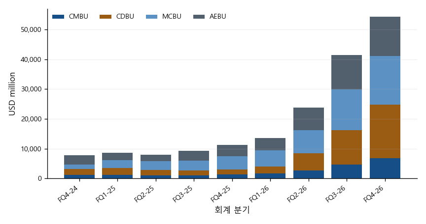

CAPTION: 그림 1. 사업부별 매출 구성 — USD million · Micron 분기 실적 보도자료(8-K EX-99.1); Micron FQ4 FY26 실적 보도자료(8-K EX-99.1) (FQ1-25, FQ1-26, FQ2-26, FQ4-24) · 2026-10-04 · 근거 등급·회계 기준: GAAP 실제(A) 사업부 매출

## 2. 강세와 약세

아래 논거는 결론이 아니라 관측 대상이다. 각 논거마다 무엇이 관측되면 그 논거가 틀린 것인지(반증 관측원)를 함께 적는다.

### **강세 논거**

#### **공급 부족이 2026년보다 2027·2028년에 더 심해진다고 회사가 밝혔다.**

| 연도 | 회사 진술 | 쪽 |
|---|---|---|
| 2027 | DRAM·NAND 공급 제약 지속 예상 | Micron FQ4 FY26 준비문 p.5 |
| 2028 | DRAM·NAND 공급 제약 지속 예상 | Micron FQ4 FY26 준비문 p.5 |

회사는 산업 DRAM·NAND가 두 해 모두 공급 제약 상태로 남고, 수급 균형 시점이 보이지 않는다고 했다(준비문 p.5).

**반증 관측원:** 분기 준비문에서 '공급 제약' 표현이 빠지거나, DRAM 가격 변화율이 음(−)으로 돌아서는 첫 분기.

*근거: Micron FQ4 FY26 준비문 p.5*

#### **FQ1 FY27 매출 가이던스가 주당 기준으로 가속했다.**

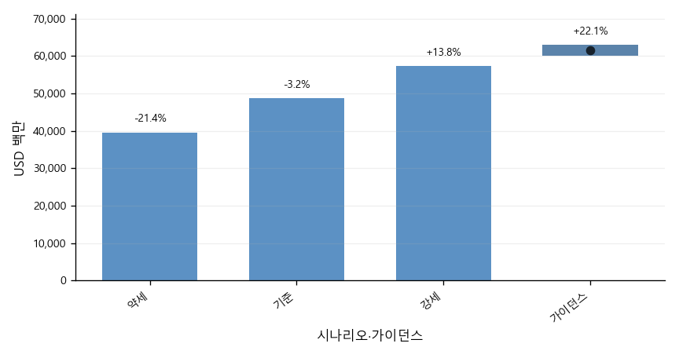

CAPTION: 그림 2. FQ1 FY27 가이던스 vs 사전등록 예측 — USD 백만 · Micron FQ4 FY26 실적 보도자료(8-K EX-99.1); MU FQ4 FY26 사전등록 전망(Freeze A) · 2026-10-04 · 근거 등급·회계 기준: GAAP PREREG_A + GUIDANCE · 예측은 사전등록 전망 §(c-2)의 가이던스 중간값(≈). 범위 막대는 회사 가이던스 하단–상단, 점은 중간값이다. % 라벨은 실제 FQ4 매출/14주 대비 FQ1/13주의 주당 성장률이다.

가이던스 중간값 $61,500M은 FQ4 실적 대비 주당 22.1% 증가다. 회사는 FY27 매 분기 순차 매출 성장을 예상했다(준비문 p.9).

**반증 관측원:** FQ1 FY27 실적이 가이던스 하단 $60,000M을 밑돈다.

*근거: Micron FQ4 FY26 보도자료(8-K EX-99.1) 실적 전망 · Micron FQ4 FY26 준비문 p.9 · SCORED §8*

#### **장기 공급 계약(SCA)이 매출의 일부에 가격 하한을 제공한다.**

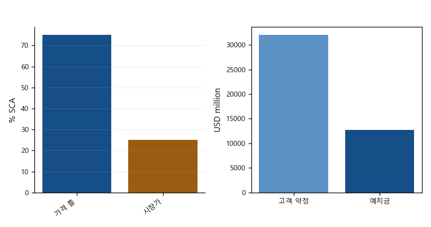

CAPTION: 그림 3. SCA 구조 — 회사 진술·USD 백만·% · Micron FQ4 FY26 준비문 · 2026-10-04 · 근거 등급·회계 기준: 회사 공시 원문 · 35% 이상은 2030년까지 총매출 중 SCA 비중의 하한; 75%/25%는 SCA 매출 내부 비중. 예치금 $12.7B는 준비문 잔액이며 EX-99.1 비유동 고객계약부채 12,895와 별도다.

체결된 SCA는 26건, 2030년까지 매출의 35% 이상으로 회사가 추정한다. 이 중 75%는 가격 틀이 정해져 있고, 다수가 하한·상한 밴드다(준비문 p.3).

**반증 관측원:** SCA 해지·재협상 공시, 또는 고객 예치금 잔액 $12,895M의 감소.

*근거: Micron FQ4 FY26 준비문 p.3 · Micron FQ4 FY26 보도자료(8-K EX-99.1) 재무상태표*

### **약세 논거**

#### **가격 상승률 둔화는 회사가 직접 말한 사실이다.**

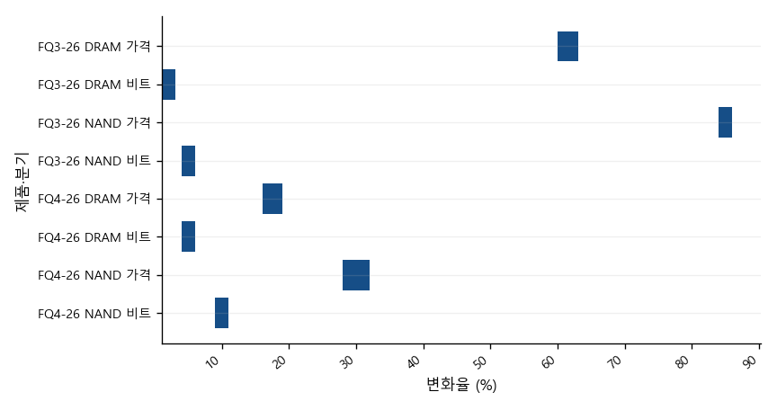

CAPTION: 그림 4. DRAM·NAND 가격·비트 변화(회사 공시 구간) — % · Micron FQ3/FQ4 FY26 준비문 p.7 · 2026-10-04 · 근거 등급·회계 기준: 회사 공시 원문 + J(저자 판단) · J(판단) 환산; 회사 수치 아님: low-single-digit = 1–3%; mid-single-digit = 4–6%; ≈10% = 9–11%; high-teens = 16–19%; ≈30% = 28–32%; low-60s = 60–63%; mid-80s = 84–86%

회사는 FQ1 이후 GM 상승을 예고하면서도 가격 상승률은 더 완만해진다고 했다(준비문 p.9).

**반증 관측원:** FQ2 FY27 준비문의 DRAM 가격 상승률이 FQ4 FY26(high-teens%)보다 높다.

*근거: Micron FQ4 FY26 준비문 p.7·p.9*

#### **SCA의 가격 상한이 상승기의 상방을 깎는다.**

(그림 3 참조)

가격 틀이 정해진 SCA 매출의 다수는 상한이 있는 밴드다. 시장가가 상한을 넘으면 그 부분은 시장가를 따라가지 못한다(준비문 p.3).

**반증 관측원:** 회사가 상한 도달 매출 비중을 공시하고, 그 비중이 작다.

*근거: Micron FQ4 FY26 준비문 p.3*

#### **비용과 투자가 빠르게 늘고 있다.**

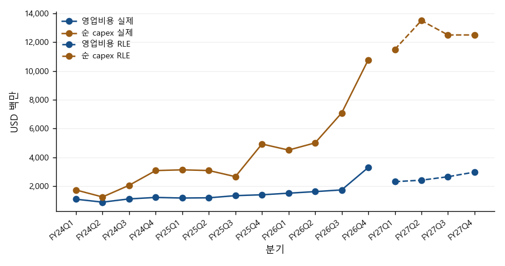

CAPTION: 그림 5. 영업비용·순 capex 추이 — USD 백만 · Micron 분기 실적 보도자료(8-K EX-99.1); Micron FQ4 FY26 실적 보도자료(8-K EX-99.1); 본 리포트 FY27E–FY28E 추정(RLE) (FQ1-25, FQ1-26, FQ2-24, FQ2-25, FQ2-26, FQ3-24, FQ3-25, FQ4-24, FQ4-25) · 2026-10-04 · 근거 등급·회계 기준: GAAP 영업비용 / 회사 조정 순 capex 실제(A) + RLE · 실선=실제, 점선=RLE; 제외 분기: 없음(원천 12개 분기 확인). 원천 누락은 빈칸이며 추정·보간하지 않는다.

FY27 opex는 약 $2.5B 증가(준비문 p.9), 순 capex는 상반기만 약 $25B다(준비문 p.10). FQ4 GAAP opex는 가이던스보다 77.2% 많았다(SCORED §4).

**반증 관측원:** FY27 분기 GAAP opex가 RLE 경로($10,353M)를 밑돈다.

*근거: Micron FQ4 FY26 준비문 p.9–10 · SCORED §4*

## 3. 사전등록 대 실적

사전등록 전망과 발표 실적은 같은 기준으로 나란히 비교한다.

<!-- BOX_START -->
### 판정 기준

**가이던스 라벨 적중** — 발표 전에 지표마다 '무차이 범위'를 정했다(매출 $49,000M–$51,000M, GAAP GM 가이던스 ±1pt 등). 실제가 범위 위면 '상단 초과', 안이면 '범위 안', 아래면 '하단 미달'이다. 사전등록 예측이 같은 라벨을 냈으면 적중이다.

**밴드 커버리지** — 실제값이 사전등록한 약세–강세 범위 안에 들었는지 본다. 범위 밖이면 예측의 불확실성 폭이 너무 좁았다는 뜻이다.

**차기 분기 방향(SF7)** — FQ1 FY27 가이던스가 FQ4 대비 주당 ±2% 안이면 보합, 위면 성장, 아래면 감소로 판정한다. 사전등록 예측은 보합이었고, 실제 가이던스는 주당 22.1% 성장이어서 MISS다.

<!-- BOX_END -->

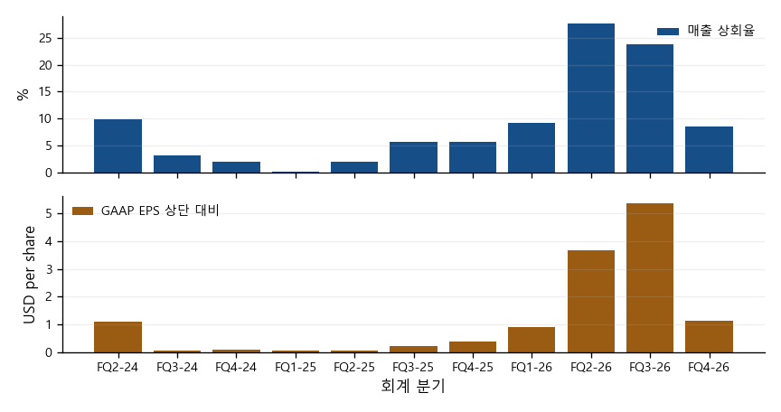

CAPTION: 그림 6. 매출 가이던스 상회율과 GAAP EPS 상회액 — % / USD per share · MU FQ4 FY26 사전등록 전망(Freeze A); Micron 분기 실적 보도자료(8-K EX-99.1); MU FQ4 FY26 사전등록 채점 문서 (FQ1-25, FQ1-26, FQ2-24, FQ2-25, FQ2-26, FQ3-24, FQ3-25, FQ3-26, FQ4-24, FQ4-25) · 2026-10-04 · 근거 등급·회계 기준: GAAP 실제와 가이던스

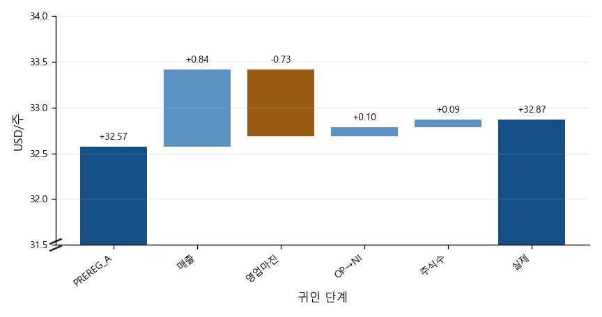

CAPTION: 그림 7. EPS 오차 4-lever 폭포 — USD/주 · MU FQ4 FY26 사전등록 채점 문서 · 2026-10-04 · 근거 등급·회계 기준: GAAP SCORED

(그림 2 참조)

### SCORED 인용 요약

| 지표 | 실적 | 사전등록 기준 | 오차 | 절대백분율오차 |
|---|---:|---:|---:|---:|
| 매출 | 54,229 | 52,860 | 1,369 | 2.5% |
| GAAP 희석 EPS | $32.87 | $32.57 | $0.30 | 0.9% |
| 비GAAP 희석 EPS | $33.42 | $32.84 | $0.58 | 1.7% |
| GAAP 영업비용 | 3,296 | 1,860 | 1,436 | 43.6% |

가이던스 라벨: 4/4 적중
밴드 커버리지: PASS · 49,000–58,223 · $29.33–$36.66
GAAP EPS 네 레버 귀인: +$0.84 / −$0.73 / +$0.10 / +$0.09 = +$0.30
차기 분기 방향 판정: MISS

| 지표 | 무차이 범위 | 실제 | 실제 라벨 | 예측 라벨 | 결과 |
|---|---|---:|---|---|---|
| 매출 | 49,000–51,000 | 54,229 | 상단 초과 | 상단 초과 | 적중 |
| GAAP 희석 EPS | 29.73–31.73 | 32.87 | 상단 초과 | 상단 초과 | 적중 |
| 비GAAP 희석 EPS | 30.00–32.00 | 33.42 | 상단 초과 | 상단 초과 | 적중 |
| GAAP GM | 85.0–87.0% | 86.76% | 범위 안 | 범위 안 | 적중 |
| GAAP opex | (선언 없음) | 3,296 | 라벨 없음(가이던스 없음) | 해당 없음(가이던스 없음) | 서술 실패 |

GAAP 영업비용은 회사 가이던스가 없어 라벨 채점 대상이 아니다. 실제가 사전등록 기준보다 77% 많아 서술 실패로 기록했다(SCORED §4).

## 4. 전망

회사 가이던스와 보고서 레이어 추정은 서로 다른 열로 구분한다.

GAAP 매출총이익률(GM)이 가이던스 중간값을 넘은 폭이 FQ2 FY26 +7.41%p에서 FQ3 +3.56%p, FQ4 +0.76%p로 빠르게 줄었다. 같은 기간 GM의 전 분기 대비 상승 폭도 줄었다.

FQ1 FY27 GAAP GM 가이던스는 85.95%로 FQ4 실제보다 낮다. 회사는 FQ4에 늘린 인센티브 보상이 재고에 흡수되어 FQ1 GM에 반영되기 때문이며, FQ1이 FY27의 바닥이라고 설명했다(준비문 p.9).

해석: GM은 이미 높은 수준이어서 추가 상승 여지가 작고, 회사도 가격 상승률 둔화를 말했다. 상회 폭이 더 줄거나 음(−)으로 바뀌면 가격 사이클 둔화의 첫 신호로 본다. 이 신호는 리스크 절의 '가격 사이클' 관측 항목과 연결된다.

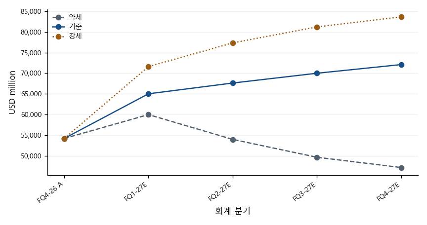

CAPTION: 그림 8. FQ4 실제에서 FY27E 시나리오 — USD million · Micron FQ4 FY26 실적 보도자료(8-K EX-99.1); 본 리포트 FY27E–FY28E 추정(RLE) · 2026-10-04 · 근거 등급·회계 기준: GAAP 실제(A-8K) + RLE 무가중 경로

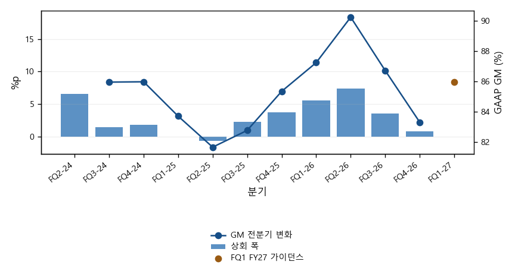

CAPTION: 그림 9. GM 상회 폭 압축 — %p · Micron FQ4 FY26 실적 보도자료(8-K EX-99.1); MU FQ4 FY26 사전등록 전망(Freeze A); MU FQ4 FY26 사전등록 채점 문서 · 2026-10-04 · 근거 등급·회계 기준: GAAP A + GUIDANCE · 막대·선은 좌측 %p, FQ1 FY27 가이던스 점은 우측 GAAP GM %. 첫 분기의 전분기 변화는 원천 비교점 부족으로 빈칸.

### FQ1 FY27 회사 가이던스

| 항목 | GAAP | 비GAAP | 기준 |
|---|---:|---:|---|
| 매출 | 61,500 ± 1,500 | 61,500 ± 1,500 | USD million, 중간값 ± 범위 |
| 매출총이익률 | 85.95% | 86.25% | 근사치 |
| 영업비용 | 2,310 | 2,060 | USD million, 근사치 |
| 희석 EPS | $37.84 ± $1.00 | $38.15 ± $1.00 | USD/share, 중간값 ± 범위 |
| 희석 가중평균 주식수 | 1,150M | 1,150M | million, 근사치 |

## 5. 사업 구조

사업부 구성과 가격·출하 신호는 공시된 범주 그대로 제시한다.

FQ4 FY26 사업부별 매출은 CDBU $18.0B(33%), CMBU $16.3B(30%), MCBU $13.1B(24%), AEBU $6.8B(13%)였다. 네 사업부 모두 사상 최대였고, 전 분기 대비 증가율은 CDBU 56%, AEBU 47%, CMBU 18%, MCBU 14%였다(준비문 p.7–8).

사업부 GM은 CDBU·MCBU 90%, AEBU 84%, CMBU 83%다. CMBU만 전 분기와 같았는데, 회사는 가격 상승을 HBM 비중 증가가 상쇄했다고 설명했다(준비문 p.7). 회사는 2027년 HBM 물량 대부분을 전년보다 크게 오른 가격으로 계약해 일반 DRAM과의 GM 차이가 좁아지고 있다고 했다(준비문 p.4).

제품별로는 DRAM $39.8B(73%), NAND $14.1B(26%)다. 데이터센터 SSD 매출은 $10B에 가까워 NAND 매출의 2/3를 넘었다(준비문 p.4·p.7).

해석: 매출의 63%가 데이터센터 사업부(CMBU·CDBU)에서 나온다. 따라서 이 리포트의 핵심 변수는 서버·AI 수요와 DRAM 가격이다. MCBU는 출하 비트가 줄었는데도 가격으로 매출이 늘었다(준비문 p.7). 가격이 꺾이면 비트 성장이 약한 사업부의 매출이 먼저 줄어들 수 있다.

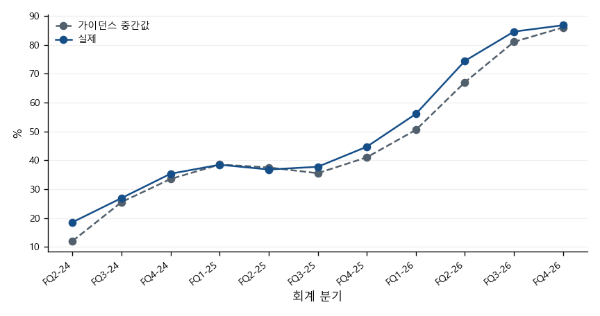

CAPTION: 그림 10. GAAP 매출총이익률 가이던스와 실제 — % · MU FQ4 FY26 사전등록 전망(Freeze A); MU FQ4 FY26 사전등록 채점 문서 · 2026-10-04 · 근거 등급·회계 기준: GAAP 가이던스와 실제

(그림 9 참조)

(그림 4 참조)

회사는 가격·비트 출하 변화를 숫자가 아니라 'high-teens %', 'mid-single-digit' 같은 구간 표현으로만 공개한다(준비문 p.7). 차트는 이 구간을 범위 막대로 그리며, 환산 규칙(예: high-teens = 16–19%)은 차트 각주에 적는다. 환산은 본 저자의 판단이며 회사 수치가 아니다.

## 6. 재무제표

재무제표와 핵심 비율은 단일 fact manifest에서 가져온다.

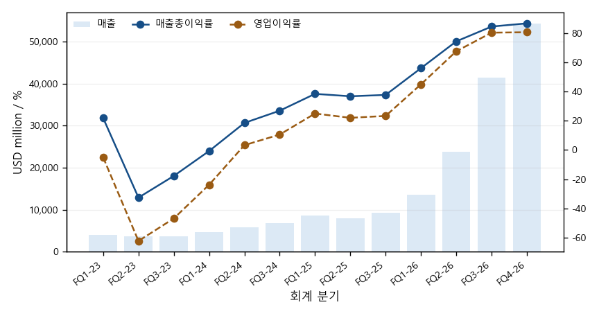

CAPTION: 그림 11. 분기 매출과 GAAP 마진 — USD million / % · SEC EDGAR Micron 재무 공시 데이터; Micron FQ4 FY26 실적 보도자료(8-K EX-99.1) · 2026-10-04 · 근거 등급·회계 기준: GAAP 실제(A), FQ4는 14주

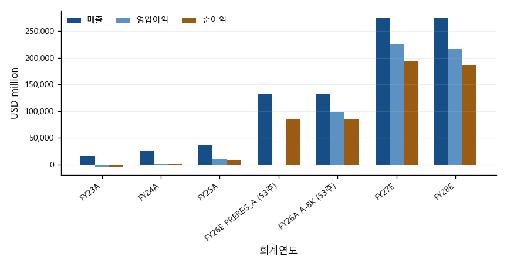

CAPTION: 그림 12. 연간 매출·영업이익·순이익 — USD million · Micron FY2025 Form 10-K; Micron FQ4 FY26 실적 보도자료(8-K EX-99.1); MU FQ4 FY26 사전등록 전망(Freeze A); 본 리포트 FY27E–FY28E 추정(RLE) · 2026-10-04 · 근거 등급·회계 기준: GAAP 실제(A) + PREREG_A + RLE

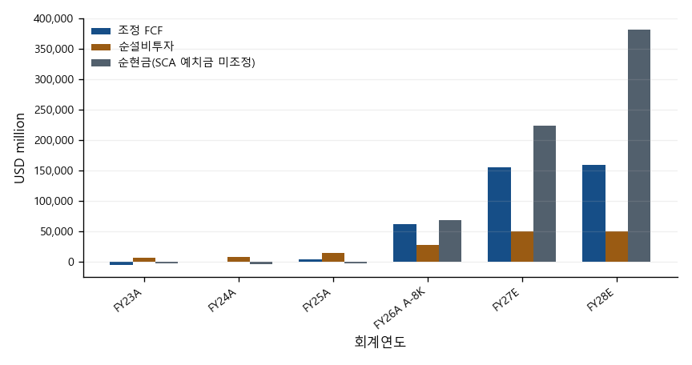

CAPTION: 그림 13. 조정 FCF·순설비투자·순현금(SCA 예치금 미조정) — USD million · Micron FY2023 Form 10-K; Micron FY2025 Form 10-K; Micron FQ4 FY26 실적 보도자료(8-K EX-99.1); 본 리포트 FY27E–FY28E 추정(RLE) · 2026-10-04 · 근거 등급·회계 기준: GAAP 현금흐름 틀·RLE, SCA 예치금 미예측

### 손익계산서 요약 (USD million, 주당금액 제외)

| 항목 | FY23A | FY24A | FY25A | FY26E PREREG_A | FY26A A-8K | FY27E RLE | FY28E RLE |
|---|---:|---:|---:|---:|---:|---:|---:|
| 매출 | 15,540 | 25,111 | 37,378 | 131,819 | 133,188 | 274,784 | 274,784 |
| 매출원가 | 16,956 | 19,498 | 22,505 | —† | 25,684 | 38,607 | 46,851 |
| 매출총이익 | -1,416 | 5,613 | 14,873 | —† | 107,504 | 236,177 | 227,933 |
| 영업비용 | — | — | — | —† | 8,164 | 10,353 | 11,181 |
| 연구개발비 | 3,114 | 3,430 | 3,798 | —† | 5,650 | —‡ | —‡ |
| 판매관리비 | 920 | 1,129 | 1,205 | —† | 1,947 | —‡ | —‡ |
| 구조조정 | 171 | 1 | 39 | —† | 0 | —‡ | —‡ |
| 기타 영업 | 124 | -251 | 61 | —† | 567 | —‡ | —‡ |
| 영업이익 | -5,745 | 1,304 | 9,770 | —† | 99,340 | 225,824 | 216,752 |
| 이자수익 | 468 | 529 | 496 | —† | 1,084 | —‡ | —‡ |
| 이자비용 | -388 | -562 | -477 | —† | -106 | —‡ | —‡ |
| 기타 영업외 | 7 | -31 | -135 | —† | -647 | —‡ | —‡ |
| 세전이익 | -5,658 | 1,240 | 9,654 | —† | 99,671 | 225,197 | 216,126 |
| 영업이익 아래 항목 | — | — | — | —† | 331 | -627 | -627 |
| 법인세 | -177 | -451 | -1,124 | —† | -14,761 | -30,794 | -29,553 |
| 지분법 | 2 | -11 | 9 | —† | 59 | —‡ | —‡ |
| 순이익 | -5,833 | 778 | 8,539 | 84,720 | 84,969 | 194,404 | 186,572 |
| 희석주식수 | 1,093 | 1,118 | 1,125 | —† | 1,143M | 1,150M | 1,150M |
| 희석 EPS | -5.34 | 0.70 | 7.59 | 73.90 | $74.33 | $169.05 | $162.24 |

† 사전등록(Freeze A)은 FQ4 분기와 FY26 매출·순이익·EPS만 예측했다.
‡ RLE 규칙은 손익·현금흐름 일부만 추정하고 재무상태표는 추정하지 않는다(부록 규칙표 A11–A16).

### 재무상태표 요약 (USD million)

| 항목 | FY23A | FY24A | FY25A | FY26E PREREG_A | FY26A A-8K | FY27E RLE | FY28E RLE |
|---|---:|---:|---:|---:|---:|---:|---:|
| 현금 | 8,577 | 7,041 | 9,642 | —† | 38,364 | —‡ | —‡ |
| 단기투자 | 1,017 | 1,065 | 665 | —† | 5,070 | —‡ | —‡ |
| 매출채권 | 2,443 | 6,615 | 9,265 | —† | 36,197 | —‡ | —‡ |
| 재고 | 8,387 | 8,875 | 8,355 | —† | 10,372 | —‡ | —‡ |
| 유동자산 | 21,244 | 24,372 | 28,841 | —† | 91,070 | —‡ | —‡ |
| 장기투자 | 844 | 1,046 | 1,629 | —† | 30,019 | —‡ | —‡ |
| 유형자산 | 37,928 | 39,749 | 46,590 | —† | 63,310 | —‡ | —‡ |
| 자산총계 | 64,254 | 69,416 | 82,798 | —† | 195,888 | —‡ | —‡ |
| 매입채무·미지급 | 3,958 | 7,299 | 9,649 | —† | 22,605 | —‡ | —‡ |
| 유동성 차입금 | 278 | 431 | 560 | —† | 491 | —‡ | —‡ |
| 유동부채 | 4,765 | 9,248 | 11,454 | —† | 27,482 | —‡ | —‡ |
| 장기차입금 | 13,052 | 12,966 | 14,017 | —† | 4,688 | —‡ | —‡ |
| 부채총계 | 20,134 | 24,285 | 28,633 | —† | 57,510 | —‡ | —‡ |
| 자본총계 | 44,120 | 45,131 | 54,165 | —† | 138,378 | —‡ | —‡ |

† 사전등록(Freeze A)은 FQ4 분기와 FY26 매출·순이익·EPS만 예측했다.
‡ RLE 규칙은 손익·현금흐름 일부만 추정하고 재무상태표는 추정하지 않는다(부록 규칙표 A11–A16).

### 현금흐름표 요약 (USD million)

| 항목 | FY23A | FY24A | FY25A | FY26E PREREG_A | FY26A A-8K | FY27E RLE | FY28E RLE |
|---|---:|---:|---:|---:|---:|---:|---:|
| 순이익 | -5,833 | 778 | 8,539 | —† | 84,969 | 194,404 | 186,572 |
| 감가상각 | 7,756 | 7,780 | 8,352 | —† | 9,503 | 14,096 | 19,837 |
| 주식보상 | 596 | 833 | 972 | —† | 1,333 | 1,972 | 2,130 |
| 운전자본 투자 | — | — | — | —† | —‡ | -4,882 | 0 |
| 매출채권 변동 | 2,763 | -3,581 | -1,776 | —† | -25,206 | —‡ | —‡ |
| 재고 변동 | -3,555 | -488 | 520 | —† | -2,017 | —‡ | —‡ |
| 매입채무 변동 | -1,302 | 1,915 | 862 | —† | 8,707 | —‡ | —‡ |
| 기타 유동부채 변동 | -817 | 989 | -272 | —† | 3,141 | —‡ | —‡ |
| 영업현금흐름 | 1,559 | 8,507 | 17,525 | —† | 89,675 | 205,589 | 208,539 |
| 유형자산 취득 | -7,676 | -8,386 | -15,857 | —† | -30,712 | —‡ | —‡ |
| 정부보조금 | 710 | 315 | 2,005 | —† | 3,316 | —‡ | —‡ |
| 유형자산 처분 | — | — | — | —† | 29 | —‡ | —‡ |
| 순설비투자 | 6,966 | 8,071 | 13,852 | —† | 27,367 | 50,000 | 50,000 |
| 조정 FCF | -5,407 | 436 | 3,673 | —† | 62,308 | 155,589 | 158,539 |
| 투자현금흐름 | -6,191 | -8,309 | -14,087 | —† | -61,641 | —‡ | —‡ |
| 차입금 상환 | -761 | -1,897 | -4,619 | —† | -10,043 | —‡ | —‡ |
| 차입금 조달 | 6,716 | 999 | 4,430 | —† | 0 | —‡ | —‡ |
| 자사주 | — | — | — | —† | -1,777 | —‡ | —‡ |
| 배당 | -504 | -513 | -522 | —† | -610 | -690 | -690 |
| 재무현금흐름 | 4,983 | -1,842 | -850 | —† | 630 | —‡ | —‡ |
| 환율 효과 | -34 | 40 | 6 | —† | 81 | —‡ | —‡ |
| 현금 증감 | 317 | -1,604 | 2,594 | —† | 28,745 | —‡ | —‡ |

† 사전등록(Freeze A)은 FQ4 분기와 FY26 매출·순이익·EPS만 예측했다.
‡ RLE 규칙은 손익·현금흐름 일부만 추정하고 재무상태표는 추정하지 않는다(부록 규칙표 A11–A16).

### 핵심 비율 및 운전자본 (%, 일, USD million)

| 항목 | FY23A | FY24A | FY25A | FY26E PREREG_A | FY26A A-8K | FY27E RLE | FY28E RLE |
|---|---:|---:|---:|---:|---:|---:|---:|
| 매출총이익률 | -9.1% | 22.4% | 39.8% | —† | 80.7% | 86.0% | 83.0% |
| 영업이익률 | -37.0% | 5.2% | 26.1% | —† | 74.6% | 82.2% | 78.9% |
| 유효세율 | -3.1% | 36.4% | 11.6% | —† | 14.8% | 13.7% | 13.7% |
| ROE | -12.4% | 1.7% | 17.2% | —† | 88.3% | —‡ | —‡ |
| 재고일수 | 161.5 | 161.1 | 139.3 | —† | 135.3 | —‡ | —‡ |
| 순설비투자/매출 | 44.8% | 32.1% | 37.1% | —† | 20.5% | 18.2% | 18.2% |
| 순현금(SCA 예치금 미조정) | -2,892 | -4,245 | -2,641 | —† | 68,274 | 223,173 | 381,022 |

† 사전등록(Freeze A)은 FQ4 분기와 FY26 매출·순이익·EPS만 예측했다.
‡ RLE 규칙은 손익·현금흐름 일부만 추정하고 재무상태표는 추정하지 않는다(부록 규칙표 A11–A16).

## 7. 마진 브리지

마진 브리지는 매출총이익과 영업비용의 변화를 분리해 보여준다.

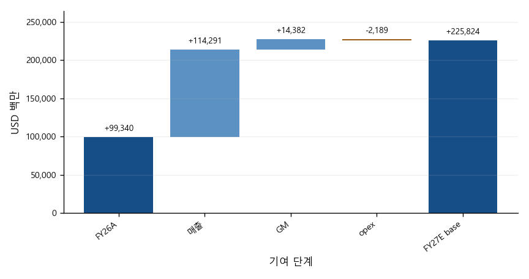

CAPTION: 그림 14. FY26A → FY27E base 영업이익 브리지 — USD 백만 · Micron FQ4 FY26 실적 보도자료(8-K EX-99.1); 본 리포트 FY27E–FY28E 추정(RLE) · 2026-10-04 · 근거 등급·회계 기준: GAAP A + RLE

### GAAP 마진·영업비용 브리지

| 구간 | 항목 | 시작 | 종료 | 변화 / 영업마진 기여 |
|---|---|---:|---:|---:|
| FQ3→FQ4 FY26 실제 | 매출총이익률 | 84.6% | 86.8% | +2.2%p |
| FQ3→FQ4 FY26 실제 | 영업비용(USD million) | 1,738 | 3,296 | 1,558 |
| FQ3→FQ4 FY26 실제 | 영업비용/매출 | 4.2% | 6.1% | -1.9%p |
| FY26A→FY27E 기준 | 매출총이익률 | 80.7% | 86.0% | +5.2%p |
| FY26A→FY27E 기준 | 영업비용(USD million) | 8,164 | 10,353 | 2,189 |
| FY26A→FY27E 기준 | 영업비용/매출 | 6.1% | 3.8% | +2.4%p |

매출총이익률 변화와 영업비용/매출 감소 기여의 합은 영업마진 변화다. 영업비용 금액 행은 금액 변화를 별도로 표시한다.

## 8. 시나리오

이 절은 두 층을 분리한다. ① 발표 전에 동결한 FQ4 FY26 예측(PREREG_A)과 그 채점, ② 발표 후 가이던스에 앵커를 둔 FY27E·FY28E 리포트 레이어 추정(RLE)이다. ①은 수정하지 않았고, ②는 예측 성능 근거가 아니다.

PREREG_A 채점 결과: 가이던스 범위 라벨 4개 모두 적중, 매출·GAAP EPS 모두 사전 밴드 안, GAAP EPS 오차 $0.30. 다만 EPS 적중은 매출 상회와 opex 초과가 상쇄된 결과이며, FQ1 방향(보합 예측)은 빗나갔다(SCORED §6·§8).

RLE는 세 경로(약세·기준·강세)를 나란히 보인다. 확률과 가중 평균은 두지 않는다. 기준 경로의 FY27E 매출은 $274,784.14M, GAAP EPS는 $169.05이며, 약세·강세 EPS는 각각 $118.95, $199.52다.

가정 규칙은 발표 전에 정했고(HANDOFF R9), 발표 후에는 세 항목만 바꿨다. GM 기준 경로(회사가 FQ1을 FY27 GM의 바닥이라고 밝힘), opex 총액(회사 가이던스 반영), capex(회사 가이던스로 대체)다. 원안·변경·사유는 부록 표에 그대로 싣는다. 단, 규칙의 SHA 기록이 발표 뒤에 이뤄져 사전등록 증거는 대화 기록뿐이라는 한계가 있다.

민감도 행은 기준 경로 외 성장률 후보 세 개와 GM 원안을 함께 보인다. 성장률 0/0/0%는 중립값이 아니라, 비트 증가가 이어질 때 가격 하락을 함의하는 방향성 가정이다.

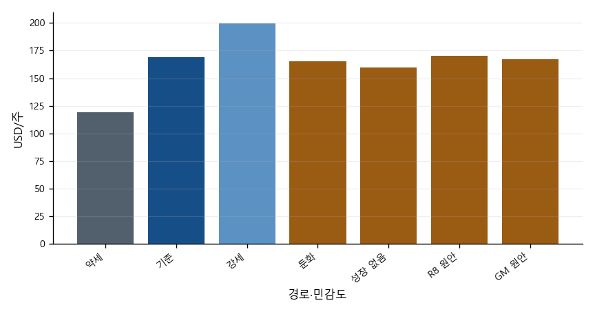

CAPTION: 그림 15. FY27E 시나리오·민감도 EPS — USD/주 · 본 리포트 FY27E–FY28E 추정(RLE) · 2026-10-04 · 근거 등급·회계 기준: GAAP RLE

## 9. 밸류에이션

밸류에이션 표는 기준일과 계산 기준을 함께 표시한다.

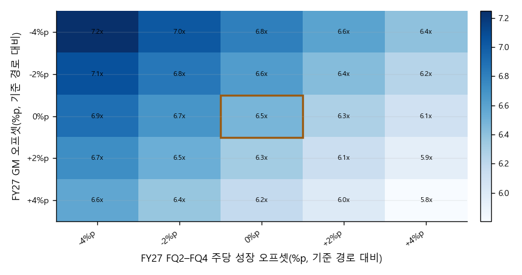

CAPTION: 그림 16. 암시 P/E 민감도 — 배; 축 단위 %p · Nasdaq MU 2026-10-01 종가 기록 1 · 2026-10-04 · 근거 등급·회계 기준: 중앙 셀=기준 경로 · 기준 주가 고정·GAAP EPS RLE 재계산

### 기준 주가 기반 암시 배수

| 기간·경로 | P/E | EV/EBITDA | EV/매출 | FCF 수익률 |
|---|---:|---:|---:|---:|
| FY2025A | 144.58x | 65.69x | 31.85x | 0.3% |
| FY2026A | 14.76x | 10.94x | 8.94x | 5.0% |
| FY2027E.bear | 9.23x | 6.78x | 5.65x | 8.0% |
| FY2027E.base | 6.49x | 4.96x | 4.33x | 12.4% |
| FY2027E.bull | 5.50x | 4.27x | 3.79x | 15.0% |
| FY2028E.bear | 17.02x | 11.08x | 7.53x | 3.8% |
| FY2028E.base | 6.76x | 5.03x | 4.33x | 12.6% |
| FY2028E.bull | 4.95x | 3.79x | 3.45x | 17.9% |

Trailing P/B: 9.10x · A-8K

주가 기준일 2026-10-01 · 자본 기준일 2026-09-03 · 주식수는 FQ4 희석 가중평균 주식수

## 10. 리스크·스윙 팩터

### **가격 사이클**

가격 상승률 둔화가 하락으로 넘어가는 시점이 가장 큰 변수다. 과거 사이클에서는 정점 직후 분기 매출이 두 자릿수 감소했다. 약세 경로는 이 꼬리를 완화해 반영했을 뿐 배제하지 않는다.

*근거: Micron FQ4 FY26 준비문 p.9 · RLE A2·A3*

### **영업이익 위 일회성**

FQ4에는 특허 라이선스 비용과 기타 영업비용이 영업이익 위에 나타나 opex가 가이던스를 크게 넘었다. 사전등록의 영업외 감시 항목(SF5)이 보지 못한 영역이며, FY27 인센티브 보상도 같은 경로로 변동할 수 있다.

*근거: Micron FQ4 FY26 보도자료(8-K EX-99.1) · SCORED §4·§7*

### **투자 확대**

FY27 순 capex는 상반기 약 $25B, 하반기는 더 높다고 회사가 밝혔다. RLE는 하반기를 상반기와 같게 두었으므로(하한) FCF가 높게 추정될 수 있다.

*근거: Micron FQ4 FY26 준비문 p.10 · RLE A14*

### **SCA 구조**

가격 하한은 하방을, 상한은 상방을 제한한다. 고객 예치금은 재무활동 현금흐름이며 계약 후반부에 돌려준다. 이 보고서의 순현금은 예치금을 조정하지 않은 값이다.

*근거: Micron FQ4 FY26 준비문 p.3·p.8–9*

### **자본환원과 주식수**

회사는 2026-12-09부터 자본환원을 늘리고 장기적으로 잉여현금의 100%를 돌려준다고 했다. RLE는 자사주 매입을 넣지 않아 EPS 상방이 빠져 있다.

*근거: Micron FQ4 FY26 준비문 p.9 · RLE A7*

### **FY28**

회사는 2028년에도 공급이 빠듯하다고 했지만, 신규 클린룸 산출이 2028년 하반기부터 늘어난다. FY28E는 무가중 스트레스 범위로만 보인다.

*근거: Micron FQ4 FY26 준비문 p.2–3·p.5 · RLE A8–A10*

(그림 5 참조)

## 11. 촉매·일정

| 시점 | 확인 항목 | 근거 |
|---|---|---|
| 2026-10-14 / 10-29 | 분기 배당 기준일 / 지급일 (주당 $0.15) | Micron FQ4 FY26 보도자료(8-K EX-99.1) |
| 2026-10 (예정) | FY26 10-K 접수 — 8-K 잠정 실적을 10-K와 대조해 사후 채점을 잠정에서 확정으로 바꿈 | SCORED |
| 2026-12-09 이후 | 자본환원 확대 시작 | Micron FQ4 FY26 준비문 p.9 |
| FQ1 FY27 실적 발표 (날짜 미공시) | 가이던스 대비 매출·GM 바닥 진술 검증, RLE 첫 비교 | Micron FQ4 FY26 준비문 p.9 |
| CY2027 초 | 싱가포르 HBM 첨단 패키징 초기 산출 | Micron FQ4 FY26 준비문 p.3 |
| CY2027 중반 | 아이다호 ID1 웨이퍼 산출 · 대만 통뤄 시설 의미 있는 출하 | Micron FQ4 FY26 준비문 p.2–3 |
| CY2027 하반기 | 차세대 DRAM·NAND 노드 양산 시작 | Micron FQ4 FY26 준비문 p.2 |
| CY2028 하반기 | ID2·일본 DRAM 확장·싱가포르 NAND 신규 시설 산출 | Micron FQ4 FY26 준비문 p.2–3 |

## 12. 부록

부록은 사전 규칙, 발표 후 변경, 해석 정정과 기록 시점 한계를 한곳에 모은다.

### 사전 등록 규칙표

전체 규칙 확신도: 하(low)

근거 등급: E(회사·사전등록 입력), D(계산값), J(저자 판단). 적용 값의 비율은 %, 금액은 USD million, 주식수는 million shares이다.

| 항목 | 규칙(문장) | 적용 값 | 근거 등급 | 출처 |
|---|---|---|---|---|
| 첫 분기 매출 | 약세는 가이던스 하단, 기준·강세는 중간값에 과거 상회율을 적용한다. | 약세: 60000; 기준: 65036.2; 강세: 71616.8; 회사 중간값 민감도: 61500 | E / J | Micron FQ4 FY26 실적 보도자료(8-K EX-99.1); MU FQ4 FY26 사전등록 채점 문서; 저자 승인 사전 규칙·사후 변경·해석 정정 |
| 후속 분기 주당 매출 성장 | 후속 분기 매출은 전분기 주당 매출에 각 경로의 성장률을 적용한다. | 약세: −10.00%/−8.00%/−5.00%; 기준: 4.00%/3.50%/3.00%; 강세: 8.00%/5.00%/3.00%; 둔화 민감도: 3.00%/2.00%/1.00% | E·D / J | 저자 승인 사전 규칙·사후 변경·해석 정정 |
| 하락 병렬 경로 | FQ1 주당 성장률이 −2% 이하이면 하락 병렬 경로를 발동한다. 주당 성장률은 FQ1 매출÷13주를 FQ4 실제 매출÷14주로 나눈 값에서 1을 뺀다. | 발동 조건: FQ1 주당 성장률 ≤ −2%; 관측 성장률: 22.13%; 가용성: 미발동 | E / J | 저자 승인 사전 규칙·사후 변경·해석 정정; Micron FQ4 FY26 실적 보도자료(8-K EX-99.1) |
| GAAP 매출총이익률 | 분기별 매출총이익은 각 경로의 매출에 해당 분기 GAAP 매출총이익률을 곱한다. | 약세: 84.95%/82.45%/79.95%/77.45%; 기준: 85.95%/85.95%/85.95%/85.95%; 강세: 86.95%/87.45%/87.95%/88.45%; 사전등록 원안 민감도: 85.95%/85.45%/84.95%/84.45% | E / J | Micron FQ4 FY26 실적 보도자료(8-K EX-99.1); 저자 승인 사전 규칙·사후 변경·해석 정정; Micron FQ4 FY26 준비문 |
| GAAP 영업비용 | 첫 분기 GAAP 가이던스와 연간 비용 안내를 분기별로 배분한다. | FQ1–FQ4 공통: 2310/2413/2654/2976; FY27E 합계: 10353 | D / J | Micron FQ4 FY26 실적 보도자료(8-K EX-99.1); Micron FQ4 FY26 준비문; 저자 승인 사전 규칙·사후 변경·해석 정정 |
| 영업이익 아래 항목 | 영업이익 아래 항목은 매출에 사전등록 비율을 곱한다. | 모든 경로: −0.23% | E / J | MU FQ4 FY26 사전등록 전망(Freeze A) |
| GAAP 유효세율 | 세전이익은 매출총이익에서 영업비용을 빼고 영업이익 아래 항목을 더한다. 가이던스 순이익과 세전이익으로 세율을 역산하며, 기준 경로의 잔여 세전 입력은 0이다. | 가용성: 역산 가용; 약세: 15.00%; 기준: 13.67%; 강세: 13.17% | D / J | 저자 승인 사전 규칙·사후 변경·해석 정정; Micron FQ4 FY26 실적 보도자료(8-K EX-99.1); MU FQ4 FY26 사전등록 전망(Freeze A) |
| 희석주식수 | 분기별 희석 가중평균 주식수는 첫 분기 가이던스를 유지하며 자사주 매입은 반영하지 않는다. | FQ1–FQ4 공통: 1150/1150/1150/1150; 자사주 매입: 0; 주식수 감소 민감도: −1.00%/−3.00% | E / J | Micron FQ4 FY26 실적 보도자료(8-K EX-99.1); 저자 승인 사전 규칙·사후 변경·해석 정정 |
| 다음 연도 매출 성장 | FY28E 매출은 FY27E 매출에 경로별 연간 성장률을 적용한다. | 약세: −25.00%; 기준: 0.00%; 강세: 10.00% | D / J | 저자 승인 사전 규칙·사후 변경·해석 정정 |
| 다음 연도 매출총이익률 | FY27 마지막 분기 매출총이익률에서 약세는 0.15, 기준은 0.03을 차감하고 강세는 유지한다. | 약세: 62.45%; 기준: 82.95%; 강세: 88.45% | D / J | 저자 승인 사전 규칙·사후 변경·해석 정정 |
| 다음 연도 영업비용 | FY28E 영업비용은 FY27E 영업비용에 1.08을 곱한다. | 모든 경로: 11181.2 | D / J | 저자 승인 사전 규칙·사후 변경·해석 정정 |
| 감가상각 | 연간 감가상각률은 FY26 감가상각÷기초·기말 유형자산 평균, 분기율은 연간율÷4이다. 기말 유형자산은 기초 유형자산＋순설비투자−감가상각이다. | FY26 연간율: 17.29%; 분기율: 4.32%; FY27E 합계: 14095.9; FY27E 기말 유형자산: 99214.1 | E / J | Micron FY2025 Form 10-K; Micron FQ4 FY26 실적 보도자료(8-K EX-99.1); 저자 승인 사전 규칙·사후 변경·해석 정정; Micron FQ4 FY26 준비문 |
| 주식보상 | 과거 주식보상÷GAAP 영업비용 비율의 중앙값에 FY27E 영업비용을 곱한다. | 과거 중앙 비율: 19.05%; FY27E 합계: 1972 | E / J | Micron FY2025 Form 10-K; Micron FQ4 FY26 실적 보도자료(8-K EX-99.1); 저자 승인 사전 규칙·사후 변경·해석 정정 |
| 운전자본 | 운전자본 증가÷매출 증가의 과거 중앙값을 연간 매출 증가에 곱한다. 현금흐름에서는 이를 차감한다. | 가용성: 가용; 과거 중앙 비율: 3.45% | E / J | 저자 승인 사전 규칙·사후 변경·해석 정정; Micron FY2023 Form 10-K; Micron FY2025 Form 10-K; Micron FQ4 FY26 실적 보도자료(8-K EX-99.1) |
| 순설비투자 | 첫 분기·상반기 회사 안내를 사용하고 하반기는 상반기와 같은 하한으로 둔다. | FQ1–FQ4 공통: 11500/13500/12500/12500; FY27E 합계: 50000; FY28E 합계: 50000; 민감도: −10.00%/−5.00%/5.00%/10.00% | E(하한) / J | Micron FQ4 FY26 준비문; 저자 승인 사전 규칙·사후 변경·해석 정정 |
| 배당 | 연간 배당은 분기 주당 배당×4분기×희석주식수이다. | 분기 주당 배당: 0.15; FY27E 합계: 690 | E / — | Micron FQ4 FY26 실적 보도자료(8-K EX-99.1); 저자 승인 사전 규칙·사후 변경·해석 정정 |
| SCA 예치금 | SCA 예치금은 순현금에서 조정하지 않으며 예측하지 않는다. | 추정기간: 추정하지 않음 | E / — | 저자 승인 사전 규칙·사후 변경·해석 정정 |
| 비GAAP 추정 | 비GAAP 조정 가정이 없어 추정하지 않는다. | 가용성: 가정이 없어 추정하지 않음 | E / — | 저자 승인 사전 규칙·사후 변경·해석 정정 |

이 규칙은 발표 전에 정해졌지만 파일과 해시는 발표 뒤에 기록되었다. 따라서 사전등록 증거는 대화 기록뿐이다.

### 발표 후 변경

| 항목 | 원안 | 변경 | 사유 | 쪽 |
|---|---|---|---|---|
| 기준 매출총이익률 | FQ1 = FQ1 GAAP GM 가이던스; 이후 분기마다 -0.5 퍼센트포인트 | FQ1 = FQ1 GAAP GM 가이던스; FQ4까지 동일; 사전등록 -0.5 퍼센트포인트 경로는 민감도로 유지 | 준비문은 첫 분기를 다음 회계연도 매출총이익률의 바닥으로 제시한다. 이후 분기를 같은 수준으로 둔 것은 새 수치를 만들지 않는 보수적 처리다. | 9 |
| 영업비용 | FY2026 GAAP 영업비용 × 52/53 + 1000; FQ1=FQ1 GAAP 영업비용 가이던스; 잔액을 30:33:37로 배분 | (6841 비GAAP 영업비용 + 2500) + 253×4 = 10353; 분기별 2310/2413/2654/2976 | 준비문의 FY2027 비GAAP 영업비용 증가 약 2500 USD million과 분기 GAAP 가산 253 USD million(연구개발 166＋판매관리 87 USD million)을 연결했다. | 9 |
| 순설비투자 | FQ4 실제 순설비투자 × 1.05, 보합; FY2027 수치 가이던스 발표 시 대체 | 11500/13500/12500/12500; FY2027 합계 50000; FY2028 합계 50000 | 준비문은 FQ1 약 11500 및 상반기 약 25000 USD million, 하반기 증가 방향을 제시한다. 하반기를 상반기와 같게 둔 것은 FCF를 높게 만드는 공개된 하한 가정이다. | 10 |

### 순설비투자 roll-forward 해석 정정

순설비투자를 유형자산 이월 계산에 사용한다. 기말 유형자산은 기초 유형자산에 순설비투자를 더하고 감가상각을 뺀 값이다. 분기 감가상각은 기초·기말 유형자산 평균에 분기율(연간율÷4분기)을 곱한다.

Micron FY2025 Form 10-K는 자본적 지출 관련 정부 인센티브가 유형자산을 줄인다고 설명한다.

정부 인센티브 수령과 유형자산 차감의 시차 및 미실현 정부 인센티브 잔액 USD 786 million은 모델링하지 않는다.

운전자본 변화는 연간 매출 변화에 k를 곱해 적용한다.

### 약어와 출처

**준비문** — Micron FQ4 FY26 실적 발표 준비문(Prepared Remarks, 2026-09-30, 10쪽)

**보도자료** — Micron FQ4 FY26 실적 보도자료(8-K EX-99.1, accession 0000723125-26-000018)

**SCORED** — 본 저자의 FQ4 FY26 사전등록 예측 사후 채점 문서(forecast/reports/mu_fy2026q4_SCORED.md)

**RLE** — 리포트 레이어 추정(Report-Layer Estimate): 발표 후 가이던스에 앵커를 둔 본 리포트의 FY27E·FY28E 추정

**PREREG_A** — 발표 전에 동결한 FQ4 FY26 사전등록 예측(Freeze A)

### 방법론과 정보 경계

숫자의 세 층은 섞지 않는다. PREREG_A는 발표 전에 동결해 이후 고치지 않았고, 발표 후 실적(A-8K)과 같은 기준으로 채점했다(SCORED). RLE는 채점이 끝난 뒤 회사 가이던스를 출발점으로 만든 추정이며, 예측 성능의 근거로 쓰지 않는다.

A-8K는 보도자료(8-K)의 잠정 실적이다. 10-K가 접수되면 같은 항목을 대조하고, 차이가 있으면 다음 판에서 고친다. A-10K는 10-K 기준 실적을 뜻한다.

근거 등급: E는 회사 공시나 사전등록 문서에 있는 값, D는 그 값으로 계산한 값, J는 저자의 판단이다. J가 들어간 값은 표와 그림 각주에 표시한다.

정보 경계: 정보 컷오프 이후 자료는 쓰지 않았다. 증권사 리포트의 수치와 의견은 쓰지 않았고, 컨센서스는 무료로 검증할 수 있는 출처가 없어 UNAVAILABLE로 둔다. 투자의견, 목표주가, 시나리오 확률은 제시하지 않는다.

검증: KO판과 EN판의 숫자 일치, 재무제표 항등식, 입력 파일 해시를 자동으로 검사하고, 전 쪽을 이미지로 확인한 뒤 발행한다.

본 문서는 투자 자문이 아닙니다.

공개 자료 기반 제3자 분석이며 Micron 및 계열사가 작성·검토·승인한 자료가 아닙니다.

발행 직전 확인 시각(2026-10-05T19:07:00+09:00) 현재, 작성자 김지원은 Micron Technology, Inc. (MU) 주식을 보유하지 않습니다.
